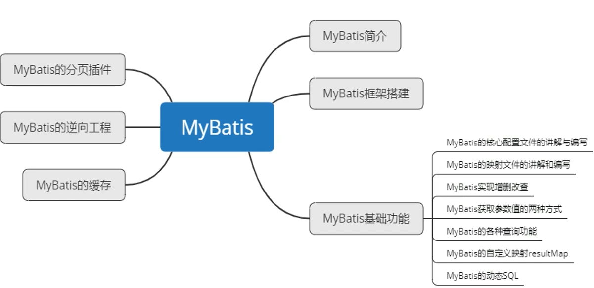
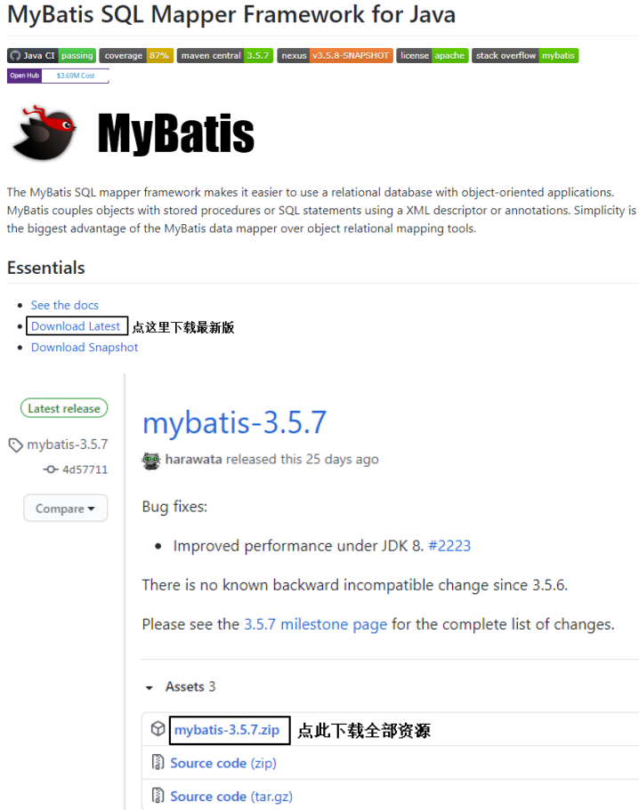
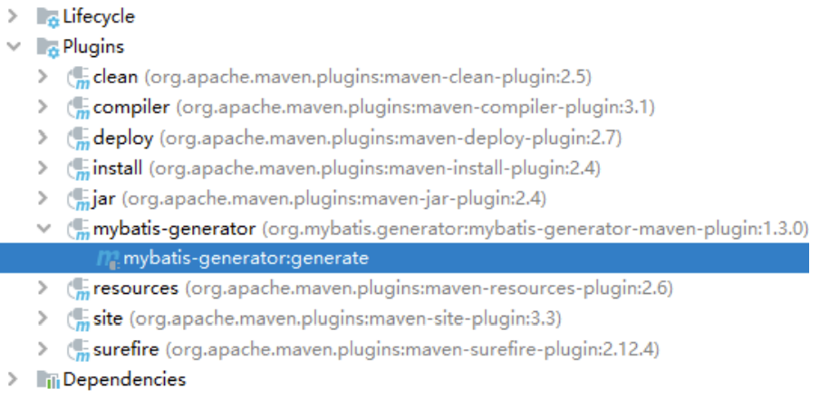
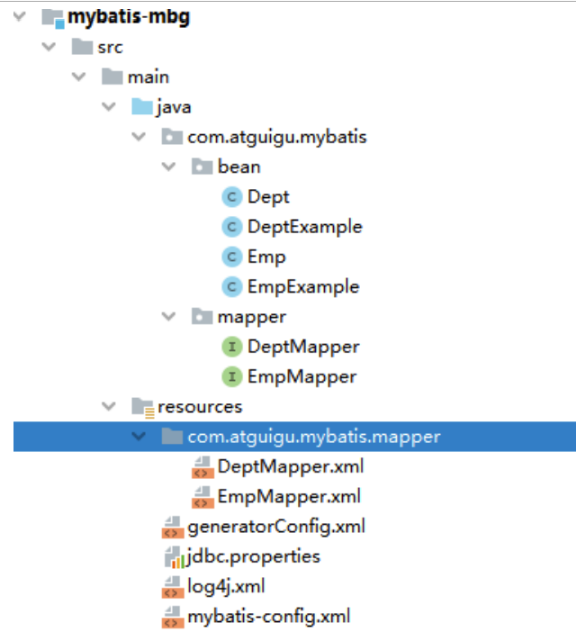
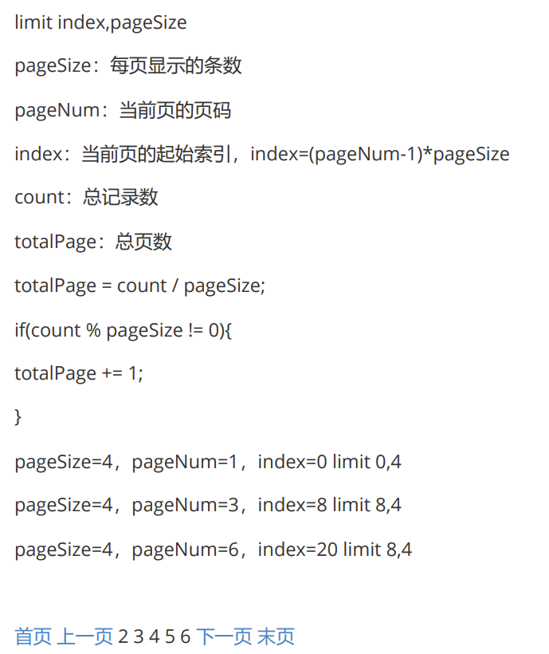

# 一、MyBatis简介

## 0、课程简介




## 1、MyBatis历史
MyBatis最初是Apache的一个开源项目iBatis, 2010年6月这个项目由Apache Software Foundation迁移到了Google Code。随着开发团队转投Google Code旗下，iBatis3.x正式更名为MyBatis。代码于2013年11月迁移到Github。
iBatis一词来源于“internet”和“abatis”的组合，是一个基于Java的持久层框架。 iBatis提供的持久层框架包括SQL Maps和Data Access Objects（DAO）。


## 2、MyBatis特性
1. MyBatis 是支持定制化 SQL、存储过程以及高级映射的优秀的持久层框架
2. MyBatis 避免了几乎所有的 JDBC 代码和手动设置参数以及获取结果集
3. MyBatis可以使用简单的XML或注解用于配置和原始映射，将接口和Java的POJO（Plain Old Java Ojects，普通的Java对象）映射成数据库中的记录
4. MyBatis 是一个 半自动的ORM（Object Relation Mapping）框架


## 3、MyBatis下载
[MyBatis-github](https://github.com/mybatis/mybatis-3)


> 当前最新：mybatis-3.5.10
> 后面都是使用Maven进行jar包的管理，此处主要是下载参考文档。


## 4、和其它持久化层技术对比
- JDBC
  - SQL 夹杂在Java代码中耦合度高，导致硬编码内伤
  - 维护不易且实际开发需求中 SQL 有变化，频繁修改的情况多见
  - 代码冗长，开发效率低（那个时候我们封装了JDBC和BaseDao）
- Hibernate 和 JPA
  - 操作简便，开发效率高
  - 程序中的长难复杂 SQL 需要绕过框架
  - 内部自动生产的 SQL，不容易做特殊优化
  - 基于全映射的全自动框架，大量字段的 POJO 进行部分映射时比较困难。
  - 反射操作太多，导致数据库性能下降
- MyBatis
  - 轻量级，性能出色
  - SQL 和 Java 编码分开，功能边界清晰。Java代码专注业务、SQL语句专注数据（此处我们将sql写在xml中与java代码分离）
  - 开发效率稍逊于Hibernate，但是完全能够接受


# 二、搭建MyBatis

## 1、开发环境（实验环境）
- IDE：idea 2019.2（vscode）
- 构建工具：maven 3.5.4（3.8.6）
- MySQL版本：MySQL 8（8.0.30）
- MyBatis版本：MyBatis 3.5.7（3.5.10）

> MySQL不同版本的注意事项
> 
> 1、驱动类driver-class-name
> - MySQL 5版本使用jdbc5驱动，驱动类使用：com.mysql.jdbc.Driver
> - MySQL 8版本使用jdbc8驱动，驱动类使用：com.mysql.cj.jdbc.Driver
> 
> 2、连接地址url
> - MySQL 5版本的url：jdbc:mysql://localhost:3306/ssm
> - MySQL 8版本的url：jdbc:mysql://localhost:3306/ssm?serverTimezone=UTC
> 
> 否则运行测试用例报告如下错误：
> java.sql.SQLException: The server time zone value 'Öйú±ê׼ʱ¼ä' is unrecognized or represents more


## 2、创建maven工程

### 1、打包方式：jar
```xml
<packaging>jar</packaging>
```

### 2、引入依赖
```xml
<dependencies>
    <!-- Mybatis核心 -->
    <dependency>
        <groupId>org.mybatis</groupId>
        <artifactId>mybatis</artifactId>
        <version>3.5.10</version>
    </dependency>
    <!-- junit测试 -->
    <dependency>
        <groupId>junit</groupId>
        <artifactId>junit</artifactId>
        <version>4.12</version>
        <scope>test</scope>
    </dependency>
    <!-- MySQL驱动 -->
    <dependency>
        <groupId>mysql</groupId>
        <artifactId>mysql-connector-java</artifactId>
        <version>8.0.30</version>
    </dependency>
</dependencies>
```


## 3、准备工作

### 1、创建数据库和表
```sql
CREATE DATABASE ssm;
USE ssm;
CREATE TABLE `t_user`  (
    `id` int NOT NULL AUTO_INCREMENT,
    `username` varchar(20) CHARACTER SET utf8mb4 COLLATE utf8mb4_0900_ai_ci NULL DEFAULT NULL,
    `password` varchar(20) CHARACTER SET utf8mb4 COLLATE utf8mb4_0900_ai_ci NULL DEFAULT NULL,
    `age` int NULL DEFAULT NULL,
    `gender` char(1) CHARACTER SET utf8mb4 COLLATE utf8mb4_0900_ai_ci NULL DEFAULT NULL,
    `email` varchar(50) CHARACTER SET utf8mb4 COLLATE utf8mb4_0900_ai_ci NULL DEFAULT NULL,
    PRIMARY KEY (`id`) USING BTREE
) ENGINE = InnoDB CHARACTER SET = utf8mb4 COLLATE = utf8mb4_0900_ai_ci ROW_FORMAT = Dynamic;
```

### 2、创建User类
```java
public class User {
    private Integer id;
    private String username;
    private String password;
    private Integer age;
    private String gender;
    private String email;

    public User() {
    }

    public User(Integer id, String username, String password, Integer age, String gender, String email) {
        this.id = id;
        this.username = username;
        this.password = password;
        this.age = age;
        this.gender = gender;
        this.email = email;
    }

    public Integer getId() {
        return id;
    }

    public void setId(Integer id) {
        this.id = id;
    }

    public String getUsername() {
        return username;
    }

    public void setUsername(String username) {
        this.username = username;
    }

    public String getPassword() {
        return password;
    }

    public void setPassword(String password) {
        this.password = password;
    }

    public Integer getAge() {
        return age;
    }

    public void setAge(Integer age) {
        this.age = age;
    }

    public String getGender() {
        return gender;
    }

    public void setGender(String gender) {
        this.gender = gender;
    }

    public String getEmail() {
        return email;
    }

    public void setEmail(String email) {
        this.email = email;
    }

    @Override
    public String toString() {
        return "User [age=" + age + ", email=" + email + ", gender=" + gender + ", id=" + id + ", password=" + password
                + ", username=" + username + "]";
    }

}
```


## 4、创建MyBatis的核心配置文件
> 习惯上命名为 `mybatis-config.xml`，这个文件名仅仅只是建议，并非强制要求。将来整合Spring之后，这个配置文件可以省略，所以大家操作时可以直接复制、粘贴。
> 核心配置文件主要用于配置连接数据库的环境以及MyBatis的全局配置信息
> 核心配置文件存放的位置是src/main/resources目录下

```xml
<?xml version="1.0" encoding="UTF-8"?>
<!DOCTYPE configuration
        PUBLIC "-//mybatis.org//DTD Config 3.0//EN"
        "http://mybatis.org/dtd/mybatis-3-config.dtd">
<configuration>
    <!--设置连接数据库的环境-->
    <environments default="development">
        <environment id="development">
            <transactionManager type="JDBC" />
            <dataSource type="POOLED">
                <property name="driver" value="com.mysql.cj.jdbc.Driver" />
                <property name="url" value="jdbc:mysql://localhost:3306/ssm?serverTimezone=UTC" />
                <property name="username" value="root" />
                <property name="password" value="123456" />
            </dataSource>
        </environment>
    </environments>

    <!--引入MyBatis映射文件-->
    <mappers>
        <mapper resource="mappers/UserMapper.xml" /> <!--该文件下面会创建-->
    </mappers>
</configuration>
```


## 5、创建mapper接口
> MyBatis中的mapper接口相当于以前的dao。但是区别在于，mapper仅仅是接口，我们不需要提供实现类。

```java
public interface UserMapper {
    /**
     * 添加用户信息
     */
    int insertUser();
}
```


## 6、创建MyBatis的映射文件
相关概念：ORM（Object Relationship Mapping）对象关系映射。
- 对象：Java的实体类对象
- 关系：关系型数据库
- 映射：二者之间的对应关系

| Java概念 | 数据库概念 |
| -------- | ---------- |
| 类       | 表         |
| 属性     | 字段/列    |
| 对象     | 记录/行    |

> 1、映射文件的命名规则：
> 表所对应的实体类的类名+Mapper.xml
> 例如：表t_user，映射的实体类为User，所对应的映射文件为UserMapper.xml
> 因此一个映射文件对应一个实体类，对应一张表的操作
> MyBatis映射文件用于编写SQL，访问以及操作表中的数据
> MyBatis映射文件存放的位置是src/main/resources/mappers目录下
> 
> 2、MyBatis中可以面向接口操作数据，要保证两个一致：
> - mapper接口的全类名和映射文件的命名空间（namespace）保持一致
> - mapper接口中方法的方法名和映射文件中编写SQL的标签的id属性保持一致
> 
> sql语句的唯一标识：命名空间.方法名

```xml
<?xml version="1.0" encoding="UTF-8"?>
<!DOCTYPE mapper
        PUBLIC "-//mybatis.org//DTD Mapper 3.0//EN"
        "http://mybatis.org/dtd/mybatis-3-mapper.dtd">
<mapper namespace="com.atguigu.mybatis.mapper.UserMapper">
    <!--int insertUser();-->
    <insert id="insertUser">
        insert into t_user values(null,'admin','123456',23,'男','12345@qq.com')
    </insert>
</mapper>
```


## 7、通过junit测试功能
```java
@Test
public void testInsert() throws IOException {
    // 获取MyBatis的核心配置文件的输入流
    InputStream is = Resources.getResourceAsStream("mybatis-config.xml");
    // 创建SqlSessionFactoryBuilder对象
    SqlSessionFactoryBuilder sqlSessionFactoryBuilder = new SqlSessionFactoryBuilder();
    // 通过核心配置文件所对应的字节输入流创建工厂类SqlSessionFactory，生产SqlSession对象
    SqlSessionFactory sqlSessionFactory = sqlSessionFactoryBuilder.build(is);
    // 1创建SqlSession对象，此时通过SqlSession对象所操作的sql都必须手动提交或回滚事务
    // SqlSession sqlSession = sqlSessionFactory.openSession();
    // 2创建SqlSession对象，此时通过SqlSession对象所操作的sql都会自动提交
    SqlSession sqlSession = sqlSessionFactory.openSession(true);
    // 通过代理模式创建UserMapper接口的代理实现类对象
    UserMapper userMapper = sqlSession.getMapper(UserMapper.class);
    // 调用UserMapper接口中的方法，就可以根据UserMapper的全类名匹配元素文件，通过调用的方法名匹配映射文件中的SQL标签，并执行标签中的SQL语句
    int result = userMapper.insertUser();
    // 1提交事务
    // sqlSession.commit();
    System.out.println("结果：" + result);
    sqlSession.close();
}
```

> - SqlSession：代表Java程序和数据库之间的会话。（HttpSession是Java程序和浏览器之间的会话）
> - SqlSessionFactory：是“生产”SqlSession的“工厂”。
> - 工厂模式：如果创建某一个对象，使用的过程基本固定，那么我们就可以把创建这个对象的相关代码封装到一个“工厂类”中，以后都使用这个工厂类来“生产”我们需要的对象。

> 其他：
> - MyBatis的面向接口编程：此处的SqlSessionFactory、SqlSession及XxxMapper都是接口。
> - 命名空间是映射文件的唯一标识，sql的id是sql语句的唯一标识。唯一定位sql：namespace.sqlId

```java
// 面向接口的实现逻辑：通过Mapper接口的全类名找到映射文件
//                   通过方法名找到sql语句执行。
sqlSession.insert("com.atguigu.mybatis.mapper.UserMapper.insertUser", null);
// 提供sql语句的唯一标识找到sql并执行，唯一标识是namespace.sqlId
// 我们后面几乎不会使用这种方法，而是获取Mapper接口的代理实现类对象。
```

### 源码验证
当我们调用 `userMapper.insertUser();`，会执行以下方法：

org.apache.ibatis.binding.MapperProxy
```java
@Override
public Object invoke(Object proxy, Method method, Object[] args) throws Throwable {
    try {
        if (Object.class.equals(method.getDeclaringClass())) {
            return method.invoke(this, args);
        } else {
            return cachedInvoker(method).invoke(proxy, method, args, sqlSession); // invoke方法就是执行的方法
        }
    } catch (Throwable t) {
        throw ExceptionUtil.unwrapThrowable(t);
    }
}
```

之后会进入该类中的一个私有、静态的成员内部类PlainMethodInvoker执行 `mapperMethod.execute(sqlSession, args);`：

org.apache.ibatis.binding.MapperMethod
```java
public Object execute(SqlSession sqlSession, Object[] args) {
    Object result;
    // 我们执行的sql被封装到了command中，其中封装了以下内容：
    // name:"com.atguigu.mybatis.mapper.UserMapper.insertUser"
    // type:SqlCommandType@89 "INSERT"
    switch (command.getType()) {
        case INSERT: {
            Object param = method.convertArgsToSqlCommandParam(args);
            // 此处其实还是相当于执行了sqlSession.insert("com.atguigu.mybatis.mapper.UserMapper.insertUser", null);
            result = rowCountResult(sqlSession.insert(command.getName(), param));
            break;
        }
        case UPDATE: {
            Object param = method.convertArgsToSqlCommandParam(args);
            result = rowCountResult(sqlSession.update(command.getName(), param));
            break;
        }
        case DELETE: {
            Object param = method.convertArgsToSqlCommandParam(args);
            result = rowCountResult(sqlSession.delete(command.getName(), param));
            break;
        }
        case SELECT:
            if (method.returnsVoid() && method.hasResultHandler()) {
                executeWithResultHandler(sqlSession, args);
                result = null;
            } else if (method.returnsMany()) {
                result = executeForMany(sqlSession, args);
            } else if (method.returnsMap()) {
                result = executeForMap(sqlSession, args);
            } else if (method.returnsCursor()) {
                result = executeForCursor(sqlSession, args);
            } else {
                Object param = method.convertArgsToSqlCommandParam(args);
                result = sqlSession.selectOne(command.getName(), param);
                if (method.returnsOptional()
                        && (result == null || !method.getReturnType().equals(result.getClass()))) {
                    result = Optional.ofNullable(result);
                }
            }
            break;
        case FLUSH:
            result = sqlSession.flushStatements();
            break;
        default:
            throw new BindingException("Unknown execution method for: " + command.getName());
    }
    if (result == null && method.getReturnType().isPrimitive() && !method.returnsVoid()) {
        throw new BindingException("Mapper method '" + command.getName()
                + " attempted to return null from a method with a primitive return type (" + method.getReturnType()
                + ").");
    }
    return result;
}
```


## 8、加入log4j日志功能

### 1、加入依赖
```xml
<!-- log4j日志 -->
<dependency>
    <groupId>log4j</groupId>
    <artifactId>log4j</artifactId>
    <version>1.2.17</version>
</dependency>
```

### 2、加入log4j的配置文件
> log4j的配置文件名为 `log4j.xml`，存放的位置是src/main/resources目录

```xml
<?xml version="1.0" encoding="UTF-8"?>
<!DOCTYPE log4j:configuration SYSTEM "log4j.dtd">
<log4j:configuration xmlns:log4j="http://jakarta.apache.org/log4j/">
    <appender name="STDOUT" class="org.apache.log4j.ConsoleAppender">
        <param name="Encoding" value="UTF-8" />
        <layout class="org.apache.log4j.PatternLayout">
            <param name="ConversionPattern" value="%-5p %d{MM-dd HH:mm:ss,SSS} %m (%F:%L) \n" />
        </layout>
    </appender>
    <logger name="java.sql">
        <level value="debug" />
    </logger>
    <logger name="org.apache.ibatis">
        <level value="info" />
    </logger>
    <root>
        <level value="debug" />
        <appender-ref ref="STDOUT" />
    </root>
</log4j:configuration>
```

> 日志的级别
> FATAL(致命) > ERROR(错误) > WARN(警告) > INFO(信息) > DEBUG(调试)
> 从左到右打印的内容越来越详细


# 三、核心配置文件详解
核心配置文件中的标签必须按照固定的顺序：
> properties?,settings?,typeAliases?,typeHandlers?,objectFactory?,objectWrapperFactory?,reflectorFactory?,plugins?,environments?,databaseIdProvider?,mappers?

```xml
<?xml version="1.0" encoding="UTF-8"?>
<!DOCTYPE configuration
        PUBLIC "-//MyBatis.org//DTD Config 3.0//EN"
        "http://MyBatis.org/dtd/MyBatis-3-config.dtd">
<configuration>
    <!--MyBatis核心配置文件中，标签的顺序：properties?,settings?,typeAliases?,typeHandlers?,objectFactory?,objectWrapperFactory?,reflectorFactory?,plugins?,environments?,databaseIdProvider?,mappers?-->
    <!--引入properties文件，此时就可以在当前文件中使用${属性名}的方式访问属性值-->
    <properties resource="jdbc.properties"></properties>
    <settings>
        <!--将表中字段的下划线自动转换为驼峰-->
        <setting name="mapUnderscoreToCamelCase" value="true" />
        <!--开启延迟加载-->
        <setting name="lazyLoadingEnabled" value="true" />
    </settings>
    <typeAliases>
        <!--
            typeAlias：设置某个具体的类型的别名，在MyBatis的范围中，就可以使用别名来表示一个具体的类型
            属性：
                type：需要设置别名的类型的全类名
                alias：设置此类型的别名，若不设置此属性，该类型拥有默认的别名，即类名且不区分大小写。若设置此属性，此时该类型的别名只能使用alias所设置的值
        -->
        <!--<typeAlias type="com.atguigu.mybatis.pojo.User"></typeAlias>-->
        <!--<typeAlias type="com.atguigu.mybatis.pojo.User" alias="abc"></typeAlias>-->
        <!--以包为单位，设置改包下所有的类型都拥有默认的别名，即类名且不区分大小写-->
        <package name="com.atguigu.mybatis.pojo" />
    </typeAliases>
    <!--
        environments：设置多个连接数据库的环境
        属性：
            default：设置默认使用的环境的id
    -->
    <environments default="development">
        <!--
            environment：设置具体的连接数据库的环境信息
            属性：
                id：设置环境的唯一标识，可通过environments标签中的default设置某一个环境的id，表示默认使用的环境
        -->
        <environment id="development">
            <!--
                transactionManager：设置事务管理方式
                属性：
                    type：设置事务管理方式，type="JDBC|MANAGED"
                    type="JDBC"：表示使用JDBC中原生的事务管理方式，设置后当前环境的事务管理都必须手动处理
                    type="MANAGED"：设置事务被管理，例如spring中的AOP
            -->
            <transactionManager type="JDBC" />
            <!--
                dataSource：设置数据源
                属性：
                    type：设置数据源的类型，type="POOLED|UNPOOLED|JNDI"
                    type="POOLED"：使用数据库连接池，即会将创建的连接进行缓存，下次使用可以从缓存中直接获取，不需要重新创建
                    type="UNPOOLED"：不使用数据库连接池，即每次使用连接都需要重新创建
                    type="JNDI"：调用上下文中的数据源
            -->
            <dataSource type="POOLED">
                <!--设置驱动类的全类名-->
                <property name="driver" value="${jdbc.driver}" />
                <!--设置连接数据库的连接地址-->
                <property name="url" value="${jdbc.url}" />
                <!--设置连接数据库的用户名-->
                <property name="username" value="${jdbc.username}" />
                <!--设置连接数据库的密码-->
                <property name="password" value="${jdbc.password}" />
            </dataSource>
        </environment>
        <environment id="test">
            <transactionManager type="JDBC" />
            <dataSource type="POOLED">
                <property name="driver" value="com.mysql.cj.jdbc.Driver" />
                <property name="url" value="jdbc:mysql://localhost:3306/ssm?serverTimezone=UTC" />
                <property name="username" value="root" />
                <property name="password" value="123456" />
            </dataSource>
        </environment>

    </environments>
    <!--引入映射文件-->
    <mappers>
        <!-- <mapper resource="UserMapper.xml"/> -->
        <!--
            以包为单位，将包下所有的映射文件引入核心配置文件
            注意：此方式必须保证mapper接口和mapper映射文件必须在相同的包下
            1、mapper接口所在的包要和映射文件所在的包一致
            2、mapper接口要和映射文件的名字一致
        -->
        <package name="com.atguigu.mybatis.mapper" />
        <!-- resources/com/atguigu/mybatis/mapper -->
        <!-- classes/com/atguigu/mybatis/mapper -->
    </mappers>
</configuration>
```

上面引用的 `jdbc.properties` 文件内容如下：
```properties
jdbc.driver=com.mysql.cj.jdbc.Driver
jdbc.url=jdbc:mysql://localhost:3306/ssm?serverTimezone=UTC
jdbc.username=root
jdbc.password=123456
```


# 四、MyBatis的增删改查
每次都获取SqlSession有些麻烦，我们先创建一个工具类来获取。在后续整合Spring之后，我们将直接自动装配Mapper。
```java
public class SqlSessionUtil {
    public static SqlSession getSqlSession() {
        SqlSession sqlSession = null;
        try {
            // 获取核心配置文件的输入流
            InputStream is = Resources.getResourceAsStream("mybatis-config.xml");
            // 获取SqlSessionFactoryBuilder
            SqlSessionFactoryBuilder sqlSessionFactoryBuilder = new SqlSessionFactoryBuilder();
            // 获取SqlSessionFactory
            SqlSessionFactory sqlSessionFactory = sqlSessionFactoryBuilder.build(is);
            // 获取SqlSession对象
            sqlSession = sqlSessionFactory.openSession(true);
        } catch (IOException e) {
            e.printStackTrace();
        }
        return sqlSession;
    }
}
```

## 1、添加
```xml
<!--int insertUser();-->
<insert id="insertUser">
    insert into t_user values(null,'admin','123456',23,'男', '12345@qq.com')
</insert>
```


## 2、修改
```xml
<!-- int updateUser(); -->
<update id="updateUser">
    update t_user set username='root', password='123' where id=3
</update>
```

```java
@Test
public void testUpdate() {
    SqlSession sqlSession = SqlSessionUtil.getSqlSession();
    UserMapper mapper = sqlSession.getMapper(UserMapper.class);
    mapper.updateUser();
    sqlSession.close();
}
// 下面的测试类似
```


## 3、删除
```xml
<!-- int deleteUser(); -->
<delete id="deleteUser">
    delete from t_user where id=3
</delete>
```


## 4、查询一个实体类对象
```xml
<!--User getUserById();-->
<select id="getUserById" resultType="com.atguigu.mybatis.pojo.User">
    select * from t_user where id = 2
</select>
```

> 此处如果不设置resultType会出现以下异常：org.apache.ibatis.executor.ExecutorException: A query was run and no Result Maps were found for the Mapped Statement 'com.atguigu.mybatis.mapper.UserMapper.getUserById'.  It's likely that neither a Result Type nor a Result Map was specified.


## 5、查询一个list集合
```xml
<!--List<User> getUserList();-->
<select id="getUserList" resultType="com.atguigu.mybatis.pojo.User">
    select * from t_user
</select>
```

> 注意：
> 
> 1、查询的标签select必须设置属性resultType或resultMap，用于设置实体类和数据库表的映射关系（两个属性只能设置一个）
> resultType：自动映射，用于属性名和表中字段名一致的情况（设置结果类型，即查询结果要转换为的java类型）
> resultMap：自定义映射，用于一对多或多对一的映射关系，或字段名和属性名不一致的情况
> 
> 2、当查询的数据为多条时，不能使用实体类作为返回值，只能使用集合，否则会抛出异常
> TooManyResultsException；但是若查询的数据只有一条，可以使用实体类或集合作为返回值


# 五、MyBatis获取参数值的两种方式（重点）
MyBatis获取参数值的两种方式：`${}` 和 `#{}`

`${}` 的本质就是字符串拼接，`#{}`的本质就是占位符赋值

`${}` 使用字符串拼接的方式拼接sql，若为字符串类型或日期类型的字段进行赋值时，需要手动加单引号；但是 `#{}` 使用占位符赋值的方式拼接sql，此时为字符串类型或日期类型的字段进行赋值时，可以自动添加单引号

## 1、单个字面量类型的参数
若mapper接口中的方法参数为单个的字面量类型
此时可以使用 `${}` 和 `#{}` 以任意的名称获取参数的值，注意 `${}` 需要手动加单引号

> 在Mybatis3.4.x之前，`${}` 只能通过 `_parameter` 或 `value` 来获取参数值。


## 2、多个字面量类型的参数
若mapper接口中的方法参数为多个时
此时MyBatis会自动将这些参数放在一个map集合中，以arg0,arg1...为键，以参数为值；以param1,param2...为键，以参数为值；因此只需要通过 `${}` 和 `#{}` 访问map集合的键就可以获取相对应的值，注意 `${}` 需要手动加单引号


## 3、map集合类型的参数
若mapper接口中的方法需要的参数为多个时
此时可以手动创建map集合，将这些数据放在map中，只需要通过 `${}` 和 `#{}` 访问map集合的键就可以获取相对应的值，注意 `${}` 需要手动加单引号


## 4、实体类类型的参数
若mapper接口中的方法参数为实体类对象时
此时可以使用 `${}` 和 `#{}` ，通过访问实体类对象中的属性名获取属性值，注意 `${}` 需要手动加单引号

> 属性：get、set方法将get、set去掉后将首字母小写的结果。很多时候其与成员变量相同，但是有时候我们的类中没有该成员变量，但是有相应的get、set方法，那我们也认为类中拥有该属性。


## 5、使用@Param标识参数
可以通过@Param注解标识mapper接口中的方法参数
此时，会将这些参数放在map集合中，以@Param注解的value属性值为键，以参数为值；以param1,param2...为键，以参数为值；只需要通过 `${}` 和 `#{}` 访问map集合的键就可以获取相对应的值，注意 `${}` 需要手动加单引号

> 建议：除map及实体类类型的参数外，其余均使用命名参数。

实现源码：
```java
public class ParamNameResolver {

    public static final String GENERIC_NAME_PREFIX = "param";
    private final boolean useActualParamName;
    private final SortedMap<Integer, String> names;
    private boolean hasParamAnnotation;

    public ParamNameResolver(Configuration config, Method method) {
        this.useActualParamName = config.isUseActualParamName();
        final Class<?>[] paramTypes = method.getParameterTypes();
        final Annotation[][] paramAnnotations = method.getParameterAnnotations();
        final SortedMap<Integer, String> map = new TreeMap<>();
        int paramCount = paramAnnotations.length;
        // get names from @Param annotations
        for (int paramIndex = 0; paramIndex < paramCount; paramIndex++) {
            if (isSpecialParameter(paramTypes[paramIndex])) {
                // skip special parameters
                continue;
            }
            String name = null;
            for (Annotation annotation : paramAnnotations[paramIndex]) {
                if (annotation instanceof Param) {
                    hasParamAnnotation = true;
                    name = ((Param) annotation).value();
                    break;
                }
            }
            if (name == null) {
                // @Param was not specified.
                if (useActualParamName) {
                    name = getActualParamName(method, paramIndex);
                }
                if (name == null) {
                    // use the parameter index as the name ("0", "1", ...)
                    // gcode issue #71
                    name = String.valueOf(map.size());
                }
            }
            map.put(paramIndex, name);
        }
        names = Collections.unmodifiableSortedMap(map);
    }

    private String getActualParamName(Method method, int paramIndex) {
        return ParamNameUtil.getParamNames(method).get(paramIndex);
    }

    private static boolean isSpecialParameter(Class<?> clazz) {
        return RowBounds.class.isAssignableFrom(clazz) || ResultHandler.class.isAssignableFrom(clazz);
    }

    public String[] getNames() {
        return names.values().toArray(new String[0]);
    }

    public Object getNamedParams(Object[] args) {
        final int paramCount = names.size();
        if (args == null || paramCount == 0) {
            return null;
        } else if (!hasParamAnnotation && paramCount == 1) {
            Object value = args[names.firstKey()];
            return wrapToMapIfCollection(value, useActualParamName ? names.get(0) : null);
        } else {
            final Map<String, Object> param = new ParamMap<>();
            int i = 0;
            for (Map.Entry<Integer, String> entry : names.entrySet()) {
                param.put(entry.getValue(), args[entry.getKey()]);
                // add generic param names (param1, param2, ...)
                final String genericParamName = GENERIC_NAME_PREFIX + (i + 1);
                // ensure not to overwrite parameter named with @Param
                if (!names.containsValue(genericParamName)) {
                    param.put(genericParamName, args[entry.getKey()]);
                }
                i++;
            }
            return param;
        }
    }

    public static Object wrapToMapIfCollection(Object object, String actualParamName) {
        if (object instanceof Collection) {
            ParamMap<Object> map = new ParamMap<>();
            map.put("collection", object);
            if (object instanceof List) {
                map.put("list", object);
            }
            Optional.ofNullable(actualParamName).ifPresent(name -> map.put(name, object));
            return map;
        } else if (object != null && object.getClass().isArray()) {
            ParamMap<Object> map = new ParamMap<>();
            map.put("array", object);
            Optional.ofNullable(actualParamName).ifPresent(name -> map.put(name, object));
            return map;
        }
        return object;
    }

}
```


# 六、MyBatis的各种查询功能

## 1、查询一个实体类对象
```java
/**
 * 根据用户id查询用户信息
 *
 * @param id
 * @return 可以通过实体类对象、list集合、map集合接收
 */
User getUserById(@Param("id") int id);
```

```xml
<!--User getUserById(@Param("id") int id);-->
<select id="getUserById" resultType="User">
    select * from t_user where id = #{id}
</select>
```


## 2、查询一个list集合
```java
/**
 * 查询所有用户信息
 *
 * @return 可以通过实体类类型的list集合、map类型的list集合接收
 *         可以在mapper接口的方法上添加@MapKey注解，此时就可以将每条数据转换的map集合作为值，以某个字段的值作为键，放在同一个map集合中
 *         注意：一定不能通过实体类对象接收，此时会抛异常TooManyResultsException
 */
List<User> getUserList();
```

```xml
<!--List<User> getUserList();-->
<select id="getUserList" resultType="User">
    select * from t_user
</select>
```

> 当查询的数据为多条时，不能使用实体类作为返回值，否则会抛出异常TooManyResultsException；但是若查询的数据只有一条，可以使用实体类或集合作为返回值


## 3、查询单个数据
```java
/**
 * 查询用户的总记录数
 * 
 * @return 在MyBatis中，对于Java中常用的类型都设置了类型别名（其中int比较特殊，有多个别名）
 *         - 基本数据类型（下划线前缀）：int-->_int|_integer
 *         - 包装类、String（全小写）：java.lang.Integer-->integer|int
 *         - 集合、映射（全小写）：collection, list, arraylist, map, hashmap, iterator
 *         - 其他：object, date, [big]decimal
 */
int getCount();
```

```xml
<!--int getCount();-->
<select id="getCount" resultType="_integer">
    select count(id) from t_user
</select>
```


## 4、查询一条数据为map集合
```java
/**
 * 根据用户id查询用户信息为map集合
 * 
 * @param id
 * @return
 */
Map<String, Object> getUserToMap(@Param("id") int id);
```

```xml
<!--Map<String, Object> getUserToMap(@Param("id") int id);-->
<select id="getUserToMap" resultType="map">
    select * from t_user where id = #{id}
</select>
<!--结果：{password=123456, gender=男, id=1, age=23, email=12345@qq.com, username=admin}-->
```


## 5、查询多条数据为map集合

### 方式一（常用）：
```java
/**
 * 查询所有用户信息为map集合
 * 
 * @return
 *         将表中的数据以map集合的方式查询，一条数据对应一个map；若有多条数据，就会产生多个map集合，此时可以将这些map放在一个list集合中获取
 */
List<Map<String, Object>> getAllUserToMap();
```

```xml
<!--Map<String, Object> getAllUserToMap();-->
<select id="getAllUserToMap" resultType="map">
    select * from t_user
</select>
```

### 方式二：
```java
/**
 * 查询所有用户信息为map集合
 * 
 * @return
 *         将表中的数据以map集合的方式查询，一条数据对应一个map；若有多条数据，就会产生多个map集合，并且最终要以一个map的方式返回数据，此时需要通过@MapKey注解设置map集合的键，值是每条数据所对应的map集合
 */
@MapKey("id")
Map<String, Object> getAllUserToMap();
```

```xml
<!--Map<String, Object> getAllUserToMap();-->
<select id="getAllUserToMap" resultType="map">
    select * from t_user
</select>
```

结果：
```js
{
    1={password=123456, gender=男, id=1, age=23, email=12345@qq.com, username=admin},
    5={password=123456, gender=女, id=5, age=33, email=123@qq.com, username=root}
}
```


# 七、特殊SQL的执行

## 1、模糊查询
```java
/**
 * 测试模糊查询
 * 
 * @param mohu
 * @return
 */
List<User> testMohu(@Param("mohu") String mohu);
```

```xml
<!--List<User> testMohu(@Param("mohu") String mohu);-->
<select id="testMohu" resultType="User">
    <!--select * from t_user where username like '%#{mohu}%'-->
    <!-- 此处的本质是占位符，但是在''中的占位符?在参数填充时不会被解析为占位符，及该sql中没有占位符，但是尝试为第一个参数赋值，于是产生越界 -->
    <!--select * from t_user where username like '%${mohu}%'-->
    <!--select * from t_user where username like concat('%',#{mohu},'%')-->
    select * from t_user where username like "%"#{mohu}"%"
</select>
```


## 2、批量删除
```java
/**
 * 批量删除
 * 
 * @param ids
 * @return
 */
int deleteMore(@Param("ids") String ids);
```

```xml
<!--int deleteMore(@Param("ids") String ids);-->
<!-- <delete id="deleteMore">delete from t_user where id in (#{ids})</delete> -->
<!--此处占位符解析会自动添加单引号得到不正确的sql语句，执行不会报错，但是得不到正确结果（始终删除的是第一条数据（,前的值））-->
<!-- 新版mysql中，小括号中的单引号会直接报错 -->
<delete id="deleteMore">
    delete from t_user where id in (${ids})
</delete>
```


## 3、动态设置表名
```java
/**
 * 动态设置表名，查询所有的用户信息
 * 
 * @param tableName
 * @return
 */
List<User> getAllUser(@Param("tableName") String tableName);
```

```xml
<!--List<User> getAllUser(@Param("tableName") String tableName);-->
<!-- 此处占位符解析会自动添加单引号得到不正确的sql语句，（sql中表名是不能添加单引号的） -->
<select id="getAllUser" resultType="User">
    select * from ${tableName}
</select>
```


## 4、添加功能获取自增的主键
场景模拟：
```sql
t_clazz(clazz_id,clazz_name)
t_student(student_id,student_name,clazz_id)
```
1. 添加班级信息
2. 获取新添加的班级的id
3. 为班级分配学生，即将某学的班级id修改为新添加的班级的id

> 关于一对多，多对一我们的处理方式都是在多的这一方添加一的主键。

jdbc实现：
```java
PreparedStatement ps = connection.prepareStatement(sql, Statement.RETURN_GENERATED_KEYS);
ps.executeUpdate();
ResultSet resultSet = ps.getGeneratedKeys();
resultSet.next();
int id = resultSet.getInt(1);
```

MyBatis实现：
```java
/**
 * 添加用户信息
 * 
 * @param user
 * @return
 *         useGeneratedKeys：设置使用自增的主键
 *         keyProperty：因为增删改有统一的返回值是受影响的行数，因此只能将获取的自增的主键放在传输的参数user对象的某个属性中
 */
int insertUser(User user);
```

```xml
<!--int insertUser(User user);-->
<!-- 增删改操作的返回值固定为受影响的行数
    useGeneratedKeys:设置当前标签中的sql使用了自增的主键
    keyProperty:将自增的主键的值赋值给传输到映射文件中参数的某个属性 -->
<insert id="insertUser" useGeneratedKeys="true" keyProperty="id">
    insert into t_user values(null,#{username},#{password},#{age},#{gender},#{email})
</insert>
```


# 八、自定义映射resultMap

## 0、数据库及实体类的建立
```sql
CREATE TABLE `t_dept`  (
    `dept_id` int NOT NULL AUTO_INCREMENT,
    `dept_name` varchar(20) CHARACTER SET utf8mb4 COLLATE utf8mb4_0900_ai_ci NULL DEFAULT NULL,
    PRIMARY KEY (`dept_id`) USING BTREE
) ENGINE = InnoDB CHARACTER SET = utf8mb4 COLLATE = utf8mb4_0900_ai_ci ROW_FORMAT = Dynamic;

INSERT INTO `t_dept` VALUES (1, 'A');
INSERT INTO `t_dept` VALUES (2, 'B');
INSERT INTO `t_dept` VALUES (3, 'C');
INSERT INTO `t_dept` VALUES (4, 'D');

CREATE TABLE `t_emp`  (
    `emp_id` int NOT NULL AUTO_INCREMENT,
    `emp_name` varchar(20) CHARACTER SET utf8mb4 COLLATE utf8mb4_0900_ai_ci NULL DEFAULT NULL,
    `age` int NULL DEFAULT NULL,
    `gender` char(1) CHARACTER SET utf8mb4 COLLATE utf8mb4_0900_ai_ci NULL DEFAULT NULL,
    `dept_id` int NULL DEFAULT NULL,
    PRIMARY KEY (`emp_id`) USING BTREE
) ENGINE = InnoDB CHARACTER SET = utf8mb4 COLLATE = utf8mb4_0900_ai_ci ROW_FORMAT = Dynamic;

INSERT INTO `t_emp` VALUES (1, '张三', 20, '男', 1);
INSERT INTO `t_emp` VALUES (2, '李四', 22, '男', 2);
INSERT INTO `t_emp` VALUES (3, '王五', 23, '男', 3);
INSERT INTO `t_emp` VALUES (4, '赵六', 24, '男', 1);
```

```java
public class Emp {
    private Integer empId;
    private String empName;
    private Integer age;
    private String gender;

    public Emp() {
    }

    public Emp(Integer empId, String empName, Integer age, String gender) {
        this.empId = empId;
        this.empName = empName;
        this.age = age;
        this.gender = gender;
    }

    public Integer getEmpId() {
        return empId;
    }

    public void setEmpId(Integer empId) {
        this.empId = empId;
    }

    public String getEmpName() {
        return empName;
    }

    public void setEmpName(String empName) {
        this.empName = empName;
    }

    public Integer getAge() {
        return age;
    }

    public void setAge(Integer age) {
        this.age = age;
    }

    public String getGender() {
        return gender;
    }

    public void setGender(String gender) {
        this.gender = gender;
    }

    @Override
    public String toString() {
        return "Emp [age=" + age + ", empId=" + empId + ", empName=" + empName + ", gender=" + gender + "]";
    }

}
```

```java
public class Dept {
    private Integer deptId;
    private String deptName;

    public Dept() {
    }

    public Dept(Integer deptId, String deptName) {
        this.deptId = deptId;
        this.deptName = deptName;
    }

    public Integer getDeptId() {
        return deptId;
    }

    public void setDeptId(Integer deptId) {
        this.deptId = deptId;
    }

    public String getDeptName() {
        return deptName;
    }

    public void setDeptName(String deptName) {
        this.deptName = deptName;
    }

    @Override
    public String toString() {
        return "Dept [deptId=" + deptId + ", deptName=" + deptName + "]";
    }

}
```

## 1、resultMap处理字段和属性的映射关系
若字段名和实体类中的属性名不一致（该属性将不会被赋值）
> Emp [age=20, empId=null, empName=null, gender=男]

解决方法一（一般不用）：为查询的字段设置别名，和属性名保持一致
```xml
<!-- Emp getEmpByEmpId(Integer id); -->
<select id="getEmpByEmpId" resultType="Emp">
    select emp_id empId,emp_name empName,age,gender from t_emp where emp_id = #{empId}
</select>
```

解决方法二（常用）：当字段符合MySQL的要求使用_，而属性符合Java的要求使用驼峰。此时可以在MyBatis核心配置文件中设置全局配置，将_自动映射为驼峰
```xml
<!--将表中字段的下划线自动转换为驼峰-->
<setting name="mapUnderscoreToCamelCase" value="true" />
```

解决方法三：通过resultMap设置自定义映射
```xml
<!--
    resultMap：设置自定义映射
    属性：
        id：表示自定义映射的唯一标识
        type：查询的数据要映射的实体类的类型
    
    子标签：
        id：设置主键的映射关系
        result：设置普通字段的映射关系
        association：设置多对一的映射关系
        collection：设置一对多的映射关系
    属性：
        column：设置映射关系中表中的字段名，必须是sql查询出的某个字段
        property：设置映射关系中实体类中的属性名，必须是处理的实体类类型中的属性名
-->
<resultMap id="empResultMap" type="Emp">
    <id column="emp_id" property="empId" />
    <result column="emp_name" property="empName" />
    <result column="age" property="age" />
    <result column="gender" property="gender" />
</resultMap>
<!-- Emp getEmpByEmpId(Integer id); -->
<select id="getEmpByEmpId" resultMap="empResultMap">
    select * from t_emp where emp_id = #{empId}
</select>
```

> 若字段名和实体类中的属性名不一致，但是字段名符合数据库的规则（使用_），实体类中的属性名符合Java的规则（使用驼峰）
> 此时也可通过以下两种方式处理字段名和实体类中的属性的映射关系
> - 可以通过为字段起别名的方式，保证和实体类中的属性名保持一致
> - 可以在MyBatis的核心配置文件中设置一个全局配置信息mapUnderscoreToCamelCase，可以在查询表中数据时，自动将_类型的字段名转换为驼峰。
> 例如：字段名emp_id，设置了mapUnderscoreToCamelCase，此时字段名就会转换为empId


## 2、多对一映射处理
> 场景模拟：
> 查询员工信息以及员工所对应的部门信息

在Emp类中添加dept属性：
```java
private Dept dept;

public Dept getDept() {
    return dept;
}

public void setDept(Dept dept) {
    this.dept = dept;
}
```

### 1、级联属性赋值
```xml
<resultMap id="empDeptMap" type="Emp">
    <id column="emp_id" property="empId"></id>
    <result column="emp_name" property="empName"></result>
    <result column="age" property="age"></result>
    <result column="gender" property="gender"></result>
    <result column="dept_id" property="dept.deptId"></result>
    <result column="dept_name" property="dept.deptName"></result>
</resultMap>
<!--Emp getEmpAndDeptByEmpId(@Param("empId") Integer empId);-->
<select id="getEmpAndDeptByEmpId" resultMap="empDeptMap">
    select t_emp.*,t_dept.* from t_emp left join t_dept on t_emp.dept_id = t_dept.dept_id where t_emp.emp_id = #{empId}
</select>
```

### 2、association
```xml
<resultMap id="empDeptMap" type="Emp">
    <id column="emp_id" property="empId"></id>
    <result column="emp_name" property="empName"></result>
    <result column="age" property="age"></result>
    <result column="gender" property="gender"></result>
    <!--
        association:处理多对一的映射关系
            property:需要处理多对的映射关系的属性名
            javaType:该属性的类型
    -->
    <association property="dept" javaType="Dept">
        <id column="dept_id" property="deptId"></id>
        <result column="dept_name" property="deptName"></result>
    </association>
</resultMap>
<!--Emp getEmpAndDeptByEmpId(@Param("empId") Integer empId);-->
<select id="getEmpAndDeptByEmpId" resultMap="empDeptMap">
    select t_emp.*,t_dept.* from t_emp left join t_dept on t_emp.dept_id = t_dept.dept_id where t_emp.emp_id = #{empId}
</select>
```

### 3、分步查询

#### 第一步：查询员工信息
```java
/**
 * 通过分步查询查询员工信息以及所对应的部门信息的第一步
 * 
 * @param empId
 * @return
 */
Emp getEmpAndDeptByStepOne(@Param("empId") Integer empId);
```

```xml
<resultMap id="empAndDeptByStepResultMap" type="Emp">
    <id column="emp_id" property="empId" />
    <result column="emp_name" property="empName" />
    <result column="age" property="age" />
    <result column="gender" property="gender" />
    <!--
        property：设置需要处理映射关系的属性的属性名
        select：设置分步查询sql的唯一标识（namespace.sqlId，即mapper接口全类名.方法名）
        column：将查询结果中的某个字段作为分步查询的条件
    -->
    <association property="dept"
                 select="com.atguigu.mybatis.mapper.DeptMapper.getEmpAndDeptByStepTwo"
                 column="dept_id"></association>
</resultMap>
<!-- Emp getEmpAndDeptByStepOne(@Param("empId") Integer empId); -->
<select id="getEmpAndDeptByStepOne" resultMap="empAndDeptByStepResultMap">
    select * from t_emp where emp_id = #{empId}
</select>
```

#### 第二步：根据员工所对应的部门id查询部门信息
```java
/**
 * 通过分步查询查询员工信息以及所对应的部门信息的第二步
 * 
 * @param deptId
 * @return
 */
Dept getEmpAndDeptByStepTwo(@Param("deptId") Integer deptId);
```

```xml
<!-- Dept getEmpAndDeptByStepTwo(@Param("deptId") Integer deptId); -->
<select id="getEmpAndDeptByStepTwo" resultType="Dept">
    select * from t_dept where dept_id = #{deptId}
</select>
```


## 3、一对多映射处理
在Dept类中添加属性：
```java
private List<Emp> emps;

public List<Emp> getEmps() {
    return emps;
}

public void setEmps(List<Emp> emps) {
    this.emps = emps;
}
```

### 1、collection
```java
/**
 * 根据部门id查新部门以及部门中的员工信息
 * 
 * @param deptId
 * @return
 */
Dept getDeptAndEmpByDeptId(@Param("deptId") Integer deptId);
```

```xml
<resultMap id="deptAndEmpResultMap" type="Dept">
    <id column="dept_id" property="deptId" />
    <result column="dept_name" property="deptName" />
    <!--
        ofType：设置collection标签所处理的集合属性中存储数据的类型
    -->
    <collection property="emps" ofType="Emp">
        <id column="emp_id" property="empId" />
        <result column="emp_name" property="empName" />
        <result column="age" property="age" />
        <result column="gender" property="gender" />
    </collection>
</resultMap>
<!-- Dept getDeptAndEmpByDeptId(@Param("deptId") Integer deptId); -->
<select id="getDeptAndEmpByDeptId" resultMap="deptAndEmpResultMap">
    select * from t_dept left join t_emp on t_dept.dept_id = t_emp.dept_id where t_dept.dept_id = #{deptId}
</select>
```

### 2、分步查询

#### 第一步：查询部门信息
```java
/**
 * 通过分步查询查询部门信息以及所对应的员工信息的第一步
 * 
 * @param deptId
 * @return
 */
Dept getDeptAndEmpByStepOne(@Param("deptId") Integer deptId);
```

```xml
<resultMap id="deptAndEmpByStepResultMap" type="Dept">
    <id column="dept_id" property="deptId" />
    <result column="dept_name" property="deptName" />
    <collection property="emps"
                select="com.atguigu.mybatis.mapper.EmpMapper.getDeptAndEmpByStepTwo"
                column="dept_id"></collection>
</resultMap>
<!-- Dept getDeptAndEmpByStepOne(@Param("deptId") Integer deptId); -->
<select id="getDeptAndEmpByStepOne" resultMap="deptAndEmpByStepResultMap">
    select * from t_dept where dept_id = #{deptId}
</select>
```

#### 第二步：根据部门id查询部门中的所有员工
```java
/**
 * 通过分步查询查询部门信息以及所对应的员工信息的第二步
 * 
 * @param deptId
 * @return
 */
List<Emp> getDeptAndEmpByStepTwo(@Param("deptId") Integer deptId);
```

```xml
<!-- List<Emp> getDeptAndEmpByStepTwo(@Param("deptId") Integer deptId); -->
<select id="getDeptAndEmpByStepTwo" resultType="Emp">
    select * from t_emp where dept_id = #{deptId}
</select>
```


## 4、延迟加载
分步查询的优点：可以实现延迟加载，但是必须在核心配置文件中设置全局配置信息：
- lazyLoadingEnabled：延迟加载的全局开关。当开启时，所有关联对象（分布查询的后续步骤）都会延迟加载
    ```xml
    <!--开启延迟加载-->
    <setting name="lazyLoadingEnabled" value="true" />
    ```
- aggressiveLazyLoading：当开启时，任何方法的调用都会加载该对象的所有属性（即使设置了延迟加载）。否则，每个属性会按需加载。（在MyBtis3.4.1之前默认开启，之后默认关闭）

> 此时就可以实现按需加载，获取的数据是什么，就只会执行相应的sql。
> 此时可通过association和collection中的fetchType属性设置当前的分步查询是否使用延迟加载，fetchType="lazy(延迟加载)|eager(立即加载)"。
> 在开启lazyLoadingEnabled全局配置时，fetchType默认为eager，开启之后默认为lazy。


# 九、动态SQL
Mybatis框架的动态SQL技术是一种根据特定条件动态拼装SQL语句的功能，它存在的意义是为了解决拼接SQL语句字符串时的痛点问题。

## 1、if
通过test属性中的表达式判断标签中的内容是否有效（是否会拼接到sql中）
```xml
<!--List<Emp> getEmpByConditionOne(Emp emp);-->
<select id="getEmpByConditionOne" resultType="Emp">
    select * from t_emp where 1=1
    <if test="empName != null and empName != ''">
        and emp_name = #{empName}
    </if>
    <if test="age != null and age != ''">
        and age = #{age}
    </if>
    <if test="gender != null and gender != ''">
        and gender = #{gender}
    </if>
</select>
```


## 2、where
```xml
<!--List<Emp> getEmpByConditionTwo(Emp emp);-->
<select id="getEmpByConditionTwo" resultType="Emp">
    select * from t_emp
    <where>
        <if test="empName != null and empName != ''">
            emp_name = #{empName}
        </if>
        <if test="age != null and age != ''">
            and age = #{age}
        </if>
        <if test="gender != null and gender != ''">
            and gender = #{gender}
        </if>
    </where>
</select>
```

> where和if一般结合使用：
> a>若where标签中的if条件都不满足，则where标签没有任何功能，即不会添加where关键字
> b>若where标签中的if条件满足，则where标签会自动添加where关键字，并将条件最前方多余的and / or去掉
> 注意：where标签不能去掉条件最后多余的and


## 3、trim
```xml
<!--List<Emp> getEmpByCondition(Emp emp);-->
<select id="getEmpByCondition" resultType="Emp">
    select
    <include refid="empColumns"></include>
    from t_emp
    <trim prefix="where" suffixOverrides="and">
        <if test="empName != null and empName != ''">
            emp_name = #{empName} and
        </if>
        <if test="age != null and age != ''">
            age = #{age} and
        </if>
        <if test="gender != null and gender != ''">
            gender = #{gender}
        </if>
    </trim>
</select>
```

> trim用于去掉或添加标签中的内容
> 若标签中有内容时：
> prefix、suffix：在标签中内容前面或后面添加指定内容
> prefixOverrides、suffixOverrides：在标签中内容前面或后面去掉指定内容（如有多种内容中间用|隔开）
> 若标签中没有内容时，trim标签也没有任何效果


## 4、choose、when、otherwise
choose、when（至少一个）、otherwise（至多一个）相当于if...else if...else
```xml
<!--List<Emp> getEmpByChoose(Emp emp);-->
<select id="getEmpByChoose" resultType="Emp">
    select * from t_emp
    <where>
        <choose>
            <when test="empName != null and empName != ''">
                emp_name = #{empName}
            </when>
            <when test="age != null and age != ''">
                age = #{age}
            </when>
            <when test="gender != null and gender != ''">
                gender = #{gender}
            </when>
        </choose>
    </where>
</select>
```


## 5、foreach
```xml
<!--void insertMoreEmp(@Param("emps") List<Emp> emps);-->
<insert id="insertMoreEmp">
    insert into t_emp values
    <foreach collection="emps" item="emp" separator=",">
        (null,#{emp.empName},#{emp.age},#{emp.gender},null)
    </foreach>
</insert>

<!--void deleteMoreEmp(@Param("empIds") Integer[] empIds);-->
<delete id="deleteMoreEmp">
    delete from t_emp where emp_id in
    <foreach collection="empIds" item="empId" separator="," open="(" close=")">
        #{empId}
    </foreach>
    <!-- delete from t_emp where emp_id in ( ? , ? ) -->
</delete>

<!--void deleteMoreEmp(@Param("empIds") Integer[] empIds);-->
<delete id="deleteMoreEmp">
    delete from t_emp where
    <foreach collection="empIds" item="empId" separator="or">
        emp_id = #{empId}
    </foreach>
    <!-- delete from t_emp where emp_id = ? or emp_id = ? -->
</delete>
```

属性：
- collection：设置要循环的数组或集合
- item：用一个字符串表示数组或集合中的每一个数据
- separator：设置每次循环的数据之间的分隔符
- open：foreach标签所循环的所有内容的开始符
- close：foreach标签所循环的所有内容的结束符


## 6、SQL片段
可以记录一段sql，在需要用的地方使用include标签进行引用
```xml
<sql id="empColumns">
    emp_id,emp_name,age,gender,dept_id
</sql>
<include refid="empColumns"></include>
```


# 十、MyBatis的缓存

## 1、MyBatis的一级缓存
MyBatis的一级缓存是SqlSession级别的，即通过同一个SqlSession查询的数据会被缓存，再次使用同一个SqlSession查询同一条数据，会从缓存中获取。

使一级缓存失效的四种情况：
1. 不同的SqlSession对应不同的一级缓存
2. 同一个SqlSession但是查询条件不同
3. 同一个SqlSession两次查询期间执行了任何一次增删改操作
4. 同一个SqlSession两次查询期间手动清空了缓存 `sqlSession.clearCache();`


## 2、MyBatis的二级缓存
二级缓存是SqlSessionFactory级别，通过同一个SqlSessionFactory创建的SqlSession查询的结果会被缓存；此后若再次执行相同的查询语句，结果就会从缓存中获取二级缓存开启的条件：
1. 在核心配置文件中，设置全局配置属性cacheEnabled="true"，默认为true，不需要设置
2. 在映射文件中设置标签 `<cache />`
3. 二级缓存必须在SqlSession关闭 `close()` 或提交 `commit()` 之后有效
4. 查询的数据所转换的实体类类型必须实现序列化的接口

使二级缓存失效的情况：
两次查询之间执行了任意的增删改，会使一级和二级缓存同时失效


## 3、二级缓存的相关配置
在mapper配置文件中添加的cache标签可以设置一些属性（一般都是用默认配置）：
- eviction属性：缓存回收策略
  - LRU（Least Recently Used）【默认】 – 最近最少使用的：移除最长时间不被使用的对象。
  - FIFO（First in First out） – 先进先出：按对象进入缓存的顺序来移除它们。
  - SOFT – 软引用：移除基于垃圾回收器状态和软引用规则的对象。
  - WEAK – 弱引用：更积极地移除基于垃圾收集器状态和弱引用规则的对象。
- flushInterval属性：刷新间隔，单位毫秒
  - 默认情况是不设置，也就是没有刷新间隔，缓存仅仅调用语句时刷新
- readOnly属性：只读，true/false
  - true：只读缓存；会给所有调用者返回缓存对象的相同实例。因此这些对象不能被修改。这提供了很重要的性能优势。
  - false【默认】：读写缓存；会返回缓存对象的拷贝（通过序列化）。这会慢一些，但是安全。
- size属性：引用数目，正整数
  - 代表缓存最多可以存储多少个对象，太大容易导致内存溢出
- type属性：设置二级缓存的类型，详见：整合第三方缓存


## 4、MyBatis缓存查询的顺序
- 先查询二级缓存，因为二级缓存中可能会有其他程序已经查出来的数据，可以拿来直接使用。
- 如果二级缓存没有命中，再查询一级缓存
- 如果一级缓存也没有命中，则查询数据库
- SqlSession关闭之后，一级缓存中的数据会写入二级缓存


## 5、整合第三方缓存EHCache

### 1、添加依赖
```xml
<!-- Mybatis EHCache整合包 -->
<dependency>
    <groupId>org.mybatis.caches</groupId>
    <artifactId>mybatis-ehcache</artifactId>
    <version>1.2.1</version>
</dependency>
<!-- slf4j日志门面的一个具体实现 -->
<dependency>
    <groupId>ch.qos.logback</groupId>
    <artifactId>logback-classic</artifactId>
    <version>1.2.3</version>
</dependency>
```

### 2、各jar包功能
| jar包名称       | 作用                            |
| --------------- | ------------------------------- |
| mybatis-ehcache | Mybatis和EHCache的整合包        |
| ehcache         | EHCache核心包                   |
| slf4j-api       | SLF4J日志门面包                 |
| logback-classic | 支持SLF4J门面接口的一个具体实现 |


### 3、创建EHCache的配置文件ehcache.xml
```xml
<?xml version="1.0" encoding="utf-8" ?>
<ehcache xmlns:xsi="http://www.w3.org/2001/XMLSchema-instance"
         xsi:noNamespaceSchemaLocation="../config/ehcache.xsd">
    <!-- 磁盘保存路径 -->
    <diskStore path="D:\atguigu\ehcache"/>
    <defaultCache
        maxElementsInMemory="1000"
        maxElementsOnDisk="10000000"
        eternal="false"
        overflowToDisk="true"
        timeToIdleSeconds="120"
        timeToLiveSeconds="120"
        diskExpiryThreadIntervalSeconds="120"
        memoryStoreEvictionPolicy="LRU">
    </defaultCache>
</ehcache>
```

### 4、设置二级缓存的类型
```xml
<cache type="org.mybatis.caches.ehcache.EhcacheCache"/>
```

### 5、加入logback日志
存在SLF4J时，作为简易日志的log4j将失效，此时我们需要借助SLF4J的具体实现logback来打印日志。
创建logback的配置文件logback.xml
```xml
<?xml version="1.0" encoding="UTF-8"?>
<configuration debug="true">
    <!-- 指定日志输出的位置 -->
    <appender name="STDOUT"
              class="ch.qos.logback.core.ConsoleAppender">
        <encoder>
            <!-- 日志输出的格式 -->
            <!-- 按照顺序分别是：时间、日志级别、线程名称、打印日志的类、日志主体内容、换行 -->
            <pattern>[%d{HH:mm:ss.SSS}] [%-5level] [%thread] [%logger] [%msg]%n</pattern>
        </encoder>
    </appender>
    <!-- 设置全局日志级别。日志级别按顺序分别是：DEBUG、INFO、WARN、ERROR -->
    <!-- 指定任何一个日志级别都只打印当前级别和后面级别的日志。 -->
    <root level="DEBUG">
        <!-- 指定打印日志的appender，这里通过“STDOUT”引用了前面配置的appender -->
        <appender-ref ref="STDOUT" />
    </root>
    <!-- 根据特殊需求指定局部日志级别 -->
    <logger name="com.atguigu.mybatis.mapper" level="DEBUG"/>
</configuration>
```

### 6、EHCache配置文件说明
| 属性名                          | 必须? | 作用                                                                                                                                           |
| ------------------------------- | ----- | ---------------------------------------------------------------------------------------------------------------------------------------------- |
| maxElementsInMemory             | 是    | 在内存中缓存的element的最大数目                                                                                                                |
| maxElementsOnDisk               | 是    | 在磁盘上缓存的element的最大数目，若是0表示无穷大                                                                                               |
| eternal                         | 是    | 设定缓存的elements是否永远不过期。 如果为true，则缓存的数据始终有效， 如果为false那么还要根据timeToIdleSeconds、timeToLiveSeconds判断          |
| overflowToDisk                  | 是    | 设定当内存缓存溢出的时候是否将过期的element缓存到磁盘上                                                                                        |
| timeToIdleSeconds               | 否    | 当缓存在EhCache中的数据前后两次访问的时间超过timeToIdleSeconds的属性取值时， 这些数据便会删除，默认值是0,也就是可闲置时间无穷大                |
| timeToLiveSeconds               | 否    | 缓存element的有效生命期，默认是0.,也就是element存活时间无穷大                                                                                  |
| diskSpoolBufferSizeMB           | 否    | DiskStore(磁盘缓存)的缓存区大小。默认是30MB。每个Cache都应该有自己的一个缓冲区                                                                 |
| diskPersistent                  | 否    | 在VM重启的时候是否启用磁盘保存EhCache中的数据，默认是false。                                                                                   |
| diskExpiryThreadIntervalSeconds | 否    | 磁盘缓存的清理线程运行间隔，默认是120秒。每个120s， 相应的线程会进行一次EhCache中数据的清理工作                                                |
| memoryStoreEvictionPolicy       | 否    | 当内存缓存达到最大，有新的element加入的时候， 移除缓存中element的策略。 默认是LRU（最近最少使用），可选的有LFU（最不常使用）和FIFO（先进先出） |


# 十一、MyBatis的逆向工程
- 正向工程：先创建Java实体类，由框架负责根据实体类生成数据库表。Hibernate是支持正向工程的。
- 逆向工程：先创建数据库表，由框架负责根据数据库表，反向生成如下资源：
  - Java实体类
  - Mapper接口
  - Mapper映射文件

## 1、创建逆向工程的步骤

### 1、添加依赖和插件
```xml
<!-- 依赖MyBatis核心包 -->
<dependencies>
    <dependency>
        <groupId>org.mybatis</groupId>
        <artifactId>mybatis</artifactId>
        <version>3.5.10</version>
    </dependency>
    <!-- junit测试 -->
    <dependency>
        <groupId>junit</groupId>
        <artifactId>junit</artifactId>
        <version>4.12</version>
        <scope>test</scope>
    </dependency>
    <!-- log4j日志 -->
    <dependency>
        <groupId>log4j</groupId>
        <artifactId>log4j</artifactId>
        <version>1.2.17</version>
    </dependency>
    <dependency>
        <groupId>mysql</groupId>
        <artifactId>mysql-connector-java</artifactId>
        <version>8.0.30</version>
    </dependency>
</dependencies>

<!-- 控制Maven在构建过程中相关配置 -->
<build>
    <!-- 构建过程中用到的插件 -->
    <plugins>
        <!-- 具体插件，逆向工程的操作是以构建过程中插件形式出现的 -->
        <plugin>
            <groupId>org.mybatis.generator</groupId>
            <artifactId>mybatis-generator-maven-plugin</artifactId>
            <version>1.3.0</version>
            <!-- 插件的依赖 -->
            <dependencies>
                <!-- 逆向工程的核心依赖 -->
                <dependency>
                    <groupId>org.mybatis.generator</groupId>
                    <artifactId>mybatis-generator-core</artifactId>
                    <version>1.3.2</version>
                </dependency>
                <!-- MySQL驱动 -->
                <dependency>
                    <groupId>mysql</groupId>
                    <artifactId>mysql-connector-java</artifactId>
                    <version>8.0.30</version>
                </dependency>
            </dependencies>
        </plugin>
    </plugins>
</build>
```

### 2、创建MyBatis的核心配置文件（非必需）
### 3、创建逆向工程的配置文件
> 文件名必须是：generatorConfig.xml
```xml
<?xml version="1.0" encoding="UTF-8"?>
<!DOCTYPE generatorConfiguration
        PUBLIC "-//mybatis.org//DTD MyBatis Generator Configuration 1.0//EN"
        "http://mybatis.org/dtd/mybatis-generator-config_1_0.dtd">
<generatorConfiguration>
    <!--
        targetRuntime: 执行生成的逆向工程的版本
                MyBatis3Simple: 生成基本的CRUD（清新简洁版）
                MyBatis3: 生成带条件的CRUD（奢华尊享版）
    -->
    <context id="DB2Tables" targetRuntime="MyBatis3">
        <!-- 数据库的连接信息 -->
        <jdbcConnection driverClass="com.mysql.cj.jdbc.Driver"
                        connectionURL="jdbc:mysql://localhost:3306/ssm?serverTimezone=UTC"
                        userId="root"
                        password="123456"></jdbcConnection>
        <!-- javaBean的生成策略-->
        <javaModelGenerator targetPackage="com.atguigu.mybatis.pojo" targetProject=".\src\main\java"> <!--目录必须存在-->
            <property name="enableSubPackages" value="true" /> <!--是否使用子包-->
            <property name="trimStrings" value="true" /> <!--去除字段前后空格-->
        </javaModelGenerator>
        <!-- SQL映射文件的生成策略 -->
        <sqlMapGenerator targetPackage="com.atguigu.mybatis.mapper" targetProject=".\src\main\resources"> <!--目录必须存在-->
            <property name="enableSubPackages" value="true" /> <!--是否使用子包-->
        </sqlMapGenerator>
        <!-- Mapper接口的生成策略 -->
        <javaClientGenerator type="XMLMAPPER" targetPackage="com.atguigu.mybatis.mapper" targetProject=".\src\main\java"> <!--目录必须存在-->
            <property name="enableSubPackages" value="true" /> <!--是否使用子包-->
        </javaClientGenerator>
        <!-- 逆向分析的表 -->
        <!-- tableName设置为*号，可以对应所有表，此时不写domainObjectName -->
        <!-- domainObjectName属性指定生成出来的实体类的类名 -->
        <table tableName="t_emp" domainObjectName="Emp" />
        <table tableName="t_dept" domainObjectName="Dept" />
    </context>
</generatorConfiguration>
```

### 4、执行MBG插件的generate目标


效果：


> 注意：多次执行generate目标可能会引起文件内容追加，建议删除之前生成的文件在执行。


## 2、QBC（Query By Criteria）查询
```java
@Test
public void testMBG(){
    SqlSession sqlSession = SqlSessionUtil.getSqlSession();
    EmpMapper mapper = sqlSession.getMapper(EmpMapper.class);
    //根据id查询数据
    Emp emp = mapper.selectByPrimaryKey(1);
    System.out.println(emp);
    //查询所有数据
    List<Emp> list = mapper.selectByExample(null);
    list.forEach(System.out::println);
    //根据条件查询数据
    EmpExample example = new EmpExample();
    example.createCriteria().andEmpNameEqualTo("张三").andAgeGreaterThanOrEqualTo(20);
    example.or().andGenderEqualTo("男");
    List<Emp> list1 = mapper.selectByExample(example);
    list1.forEach(System.out::println);
    Emp emp1 = new Emp(1, "小黑", null, "女");
    //测试普通修改功能
    mapper.updateByPrimaryKey(emp1);
    //测试选择性修改
    mapper.updateByPrimaryKeySelective(emp1);
}
```


# 十二、分页插件


## 1、分页插件使用步骤

### 1、添加依赖
```xml
<!-- https://mvnrepository.com/artifact/com.github.pagehelper/pagehelper -->
<dependency>
    <groupId>com.github.pagehelper</groupId>
    <artifactId>pagehelper</artifactId>
    <version>5.2.0</version>
</dependency>
```

### 2、配置分页插件
在MyBatis的核心配置文件中配置插件
```xml
<plugins>
    <!--设置分页插件-->
    <plugin interceptor="com.github.pagehelper.PageInterceptor"></plugin>
</plugins>
```

> 分页插件是通过拦截器来实现的，我们不需要手动加入LIMIT，分页插件会拦截我们的查询加入分页数据。


## 2、分页插件的使用

### 1、在查询功能之前
使用 `PageHelper.startPage(int pageNum, int pageSize)` 开启分页功能
- pageNum：当前页的页码
- pageSize：每页显示的条数

### 2、在查询获取list集合之后
因为这里我们使用的是MBG自动生成的Mapper，查询多条数据的返回值写定为List。
所以使用如下语句获取分页相关数据
```java
PageInfo<T> pageInfo = new PageInfo<>(List<T> list, int navigatePages)
```
- list：分页之后的查询数据
- navigatePages：导航分页的页码数（常用奇数）

如果是我们自己写Mapper，可以直接将查询语句的返回值设置为 `Page`。
`com.github.pagehelper.Page` 声明如下，其继承了 `ArrayList`：
```java
public class Page<E> extends ArrayList<E> implements Closeable {
```

### 3、分页相关数据
```js
PageInfo{
    pageNum = 1, pageSize = 4, size = 4,
    startRow = 1, endRow = 4, total = 30,
    pages = 8,
    list = Page{
        count = true, pageNum = 1, pageSize = 4,
        startRow = 0, endRow = 4, total = 30, pages = 8,
        reasonable = false, pageSizeZero = false
    },
    [
        Emp{ empId=1, empName='aaa', age=null, gender='null', deptId=null },
        Emp{ empId=2, empName='a', age=null, gender='null', deptId=null },
        Emp{ empId=3, empName='a', age=null, gender='null', deptId=null },
        Emp{ empId=4, empName='a', age=null, gender='null', deptId=null }
    ],
    prePage = 0, nextPage = 2,
    isFirstPage = true, isLastPage = false,
    hasPreviousPage = false, hasNextPage = true,
    navigatePages = 5, navigateFirstPage = 1, navigateLastPage = 5,
    avigatepageNums = [1, 2, 3, 4, 5]
}
```

常用数据：
- pageNum：当前页的页码
- pageSize：每页显示的条数
- size：当前页显示的真实条数
- total：总记录数
- pages：总页数
- prePage：上一页的页码
- nextPage：下一页的页码
- isFirstPage/isLastPage：是否为第一页/最后一页
- hasPreviousPage/hasNextPage：是否存在上一页/下一页
- navigatePages：导航分页的页码数
- navigatepageNums：导航分页的页码，`[1,2,3,4,5]`