# 一、MyBatis-Plus简介

## 1、简介
MyBatis-Plus（简称 MP）是一个 MyBatis的增强工具，在 MyBatis 的基础上只做增强不做改变，为简化开发、提高效率而生。

> 愿景
> 我们的愿景是成为 MyBatis 最好的搭档，就像魂斗罗中的 1P、2P，基友搭配，效率翻倍。


## 2、特性
- 无侵入：只做增强不做改变，引入它不会对现有工程产生影响，如丝般顺滑
- 损耗小：启动即会自动注入基本 CURD，性能基本无损耗，直接面向对象操作
- 强大的 CRUD 操作：内置通用 Mapper、通用 Service，仅仅通过少量配置即可实现单表大部分CRUD 操作，更有强大的条件构造器，满足各类使用需求
- 支持 Lambda 形式调用：通过 Lambda 表达式，方便的编写各类查询条件，无需再担心字段写错
- 支持主键自动生成：支持多达 4 种主键策略（内含分布式唯一 ID 生成器 - Sequence），可自由配置，完美解决主键问题
- 支持 ActiveRecord 模式：支持 ActiveRecord 形式调用，实体类只需继承 Model 类即可进行强大的 CRUD 操作
- 支持自定义全局通用操作：支持全局通用方法注入（ Write once, use anywhere ）
- 内置代码生成器：采用代码或者 Maven 插件可快速生成 Mapper 、 Model 、 Service 、Controller 层代码，支持模板引擎，更有超多自定义配置等您来使用
- 内置分页插件：基于 MyBatis 物理分页，开发者无需关心具体操作，配置好插件之后，写分页等同于普通 List 查询
- 分页插件支持多种数据库：支持 MySQL、MariaDB、Oracle、DB2、H2、HSQL、SQLite、Postgre、SQLServer 等多种数据库
- 内置性能分析插件：可输出 SQL 语句以及其执行时间，建议开发测试时启用该功能，能快速揪出慢查询
- 内置全局拦截插件：提供全表 delete 、 update 操作智能分析阻断，也可自定义拦截规则，预防误操作


## 3、支持数据库
> 任何能使用MyBatis进行 CRUD, 并且支持标准 SQL 的数据库，具体支持情况如下

- MySQL，Oracle，DB2，H2，HSQL，SQLite，PostgreSQL，SQLServer，Phoenix，Gauss，ClickHouse，Sybase，OceanBase，Firebird，Cubrid，Goldilocks，csiidb
- 达梦数据库，虚谷数据库，人大金仓数据库，南大通用(华库)数据库，南大通用数据库，神通数据库，瀚高数据库


## 4、框架结构
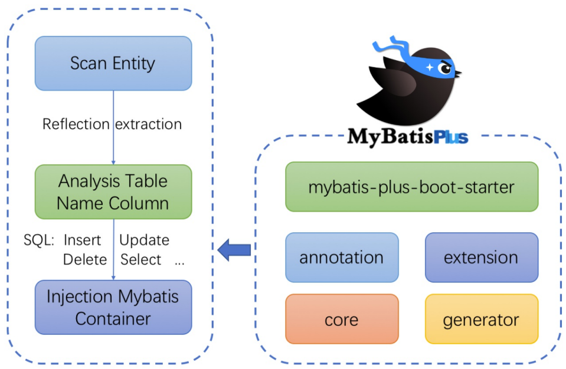


## 5、代码及文档地址
官方地址: http://mp.baomidou.com
代码发布地址:
Github: https://github.com/baomidou/mybatis-plus
Gitee: https://gitee.com/baomidou/mybatis-plus
文档发布地址: https://baomidou.com/pages/24112f


# 二、入门案例

## 1、开发环境
- IDE：idea 2019.2
- JDK：JDK8+
- 构建工具：maven 3.5.4
- MySQL版本：MySQL 5.7
- Spring Boot：2.6.3 （Spring：5.3.1）
- MyBatis-Plus：3.5.1


## 2、创建数据库及表

### a>创建表
```sql
CREATE DATABASE `mybatis_plus` /*!40100 DEFAULT CHARACTER SET utf8mb4 */;
use `mybatis_plus`;
CREATE TABLE `user` (
    `id` bigint(20) NOT NULL COMMENT '主键ID',
    `name` varchar(30) DEFAULT NULL COMMENT '姓名',
    `age` int(11) DEFAULT NULL COMMENT '年龄',
    `email` varchar(50) DEFAULT NULL COMMENT '邮箱',
PRIMARY KEY (`id`)
) ENGINE=InnoDB DEFAULT CHARSET=utf8;
```

### b>添加数据
```sql
INSERT INTO user (id, name, age, email) VALUES
(1, 'Jone', 18, 'test1@baomidou.com'),
(2, 'Jack', 20, 'test2@baomidou.com'),
(3, 'Tom', 28, 'test3@baomidou.com'),
(4, 'Sandy', 21, 'test4@baomidou.com'),
(5, 'Billie', 24, 'test5@baomidou.com');
```


## 3、【Spring Boot】创建Spring Boot工程

### a>初始化工程
使用 Spring Initializr 快速初始化一个 Spring Boot 工程
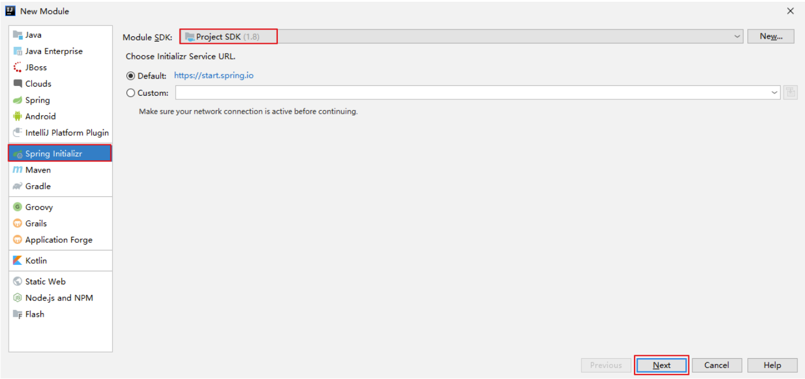
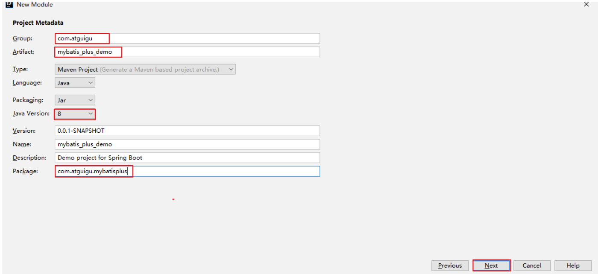
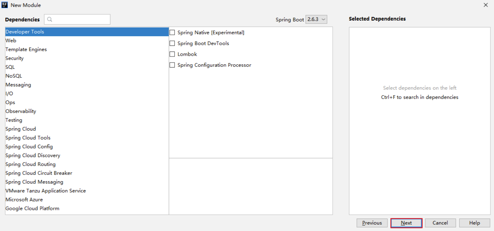
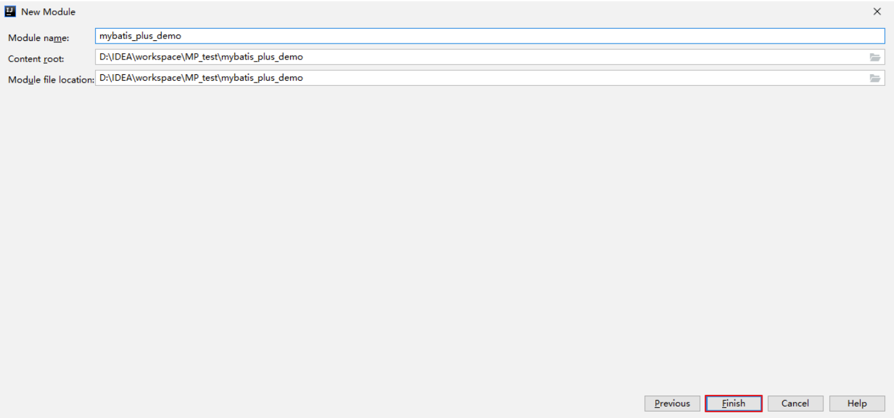

### b>引入依赖
```xml
<dependencies>
    <dependency>
        <groupId>org.springframework.boot</groupId>
        <artifactId>spring-boot-starter</artifactId>
    </dependency>
    <dependency>
        <groupId>org.springframework.boot</groupId>
        <artifactId>spring-boot-starter-test</artifactId>
        <scope>test</scope>
    </dependency>
    <dependency>
        <groupId>com.baomidou</groupId>
        <artifactId>mybatis-plus-boot-starter</artifactId>
        <version>3.5.1</version>
    </dependency>
    <dependency>
        <groupId>org.projectlombok</groupId>
        <artifactId>lombok</artifactId>
        <optional>true</optional>
    </dependency>
    <dependency>
        <groupId>mysql</groupId>
        <artifactId>mysql-connector-java</artifactId>
        <scope>runtime</scope>
    </dependency>
</dependencies>
```

### c>idea中安装lombok插件
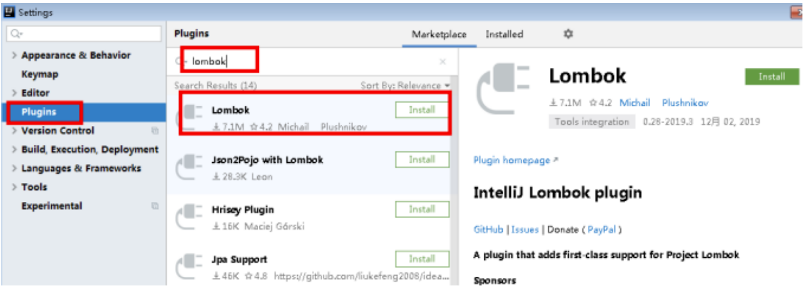


## 4、【Spring Boot】编写代码

### a>配置application.yml
```yml
spring:
    # 配置数据源信息
    datasource:
        # 配置数据源类型
        type: com.zaxxer.hikari.HikariDataSource
        # 配置连接数据库信息
        driver-class-name: com.mysql.cj.jdbc.Driver
        url: jdbc:mysql://localhost:3306/mybatis_plus?characterEncoding=utf-8&useSSL=false
        username: root
        password: 123456
```

#### 注意：
> 1、驱动类driver-class-name
> spring boot 2.0（内置jdbc5驱动），驱动类使用：
> driver-class-name: com.mysql.jdbc.Driver
> spring boot 2.1及以上（内置jdbc8驱动），驱动类使用：
> driver-class-name: com.mysql.cj.jdbc.Driver
> 否则运行测试用例的时候会有 WARN 信息
> 2、连接地址url
> MySQL5.7版本的url：
> jdbc:mysql://localhost:3306/mybatis_plus?characterEncoding=utf-8&useSSL=false
> MySQL8.0版本的url：
> jdbc:mysql://localhost:3306/mybatis_plus?serverTimezone=GMT%2B8&characterEncoding=utf-8&useSSL=false
> 否则运行测试用例报告如下错误：
> java.sql.SQLException: The server time zone value 'Öйú±ê׼ʱ¼ä' is unrecognized or represents more

### b>启动类
> 在Spring Boot启动类中添加@MapperScan注解，扫描mapper包

```java
@SpringBootApplication
@MapperScan("com.atguigu.mybatisplus.mapper")
public class MybatisplusApplication {
    public static void main(String[] args) {
        SpringApplication.run(MybatisplusApplication.class, args);
    }
}
```

### c>添加实体
```java
@Data //lombok注解
public class User {
    private Long id;
    private String name;
    private Integer age;
    private String email;
}
```

User类编译之后的结果：
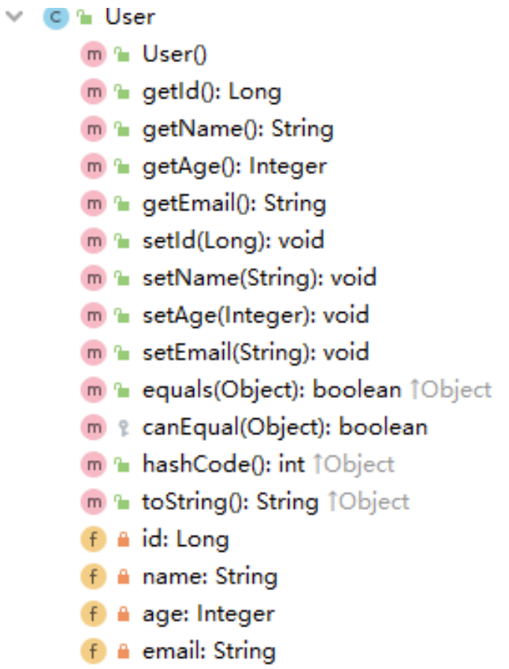

### d>添加mapper
> BaseMapper是MyBatis-Plus提供的模板mapper，其中包含了基本的CRUD方法，泛型为操作的实体类型

```java
public interface UserMapper extends BaseMapper<User> {
}
```

### e>测试
```java
@SpringBootTest
public class MybatisPlusTest {
    @Autowired
    private UserMapper userMapper;
    @Test
    public void testSelectList(){
        //selectList()根据MP内置的条件构造器查询一个list集合，null表示没有条件，即查询所有
        userMapper.selectList(null).forEach(System.out::println);
    }
}
```

#### 结果：
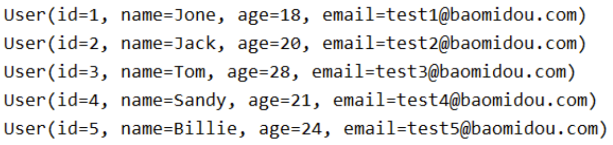

#### 注意：
> IDEA在 userMapper 处报错，因为找不到注入的对象，因为类是动态创建的，但是程序可以正确的执行。
> 为了避免报错，可以在mapper接口上添加 @Repository 注解

### f>添加日志
在application.yml中配置日志输出
```yml
# 配置MyBatis日志
mybatis-plus:
    configuration:
        log-impl: org.apache.ibatis.logging.stdout.StdOutImpl
```


## 3、【Spring】创建maven工程

### a>打包方式：jar
### b>引入依赖
```xml
<packaging>jar</packaging><properties>
    <spring.version>5.3.1</spring.version>
</properties><dependencies>
    <dependency>
        <groupId>org.springframework</groupId>
        <artifactId>spring-context</artifactId>
        <version>${spring.version}</version>
    </dependency>
    <dependency>
        <groupId>org.springframework</groupId>
        <artifactId>spring-jdbc</artifactId>
        <version>${spring.version}</version>
    </dependency>
    <dependency>
        <groupId>org.springframework</groupId>
        <artifactId>spring-test</artifactId>
        <version>${spring.version}</version>
    </dependency>
    <!-- 连接池 -->
    <dependency>
        <groupId>com.alibaba</groupId>
        <artifactId>druid</artifactId>
        <version>1.2.8</version>
    </dependency>
    <!-- junit测试 -->
    <dependency>
        <groupId>junit</groupId>
        <artifactId>junit</artifactId>
        <version>4.12</version>
        <scope>test</scope>
    </dependency>
    <!-- MySQL驱动 -->
    <dependency>
        <groupId>mysql</groupId>
        <artifactId>mysql-connector-java</artifactId>
        <version>8.0.27</version>
    </dependency>
    <!-- 日志 -->
    <dependency>
        <groupId>org.slf4j</groupId>
        <artifactId>slf4j-api</artifactId>
        <version>1.7.30</version>
    </dependency>
    <dependency>
        <groupId>ch.qos.logback</groupId>
        <artifactId>logback-classic</artifactId>
        <version>1.2.3</version>
    </dependency>
    <!-- lombok用来简化实体类 -->
    <dependency>
        <groupId>org.projectlombok</groupId>
        <artifactId>lombok</artifactId>
        <version>1.16.16</version>
    </dependency>
    <!--MyBatis-Plus的核心依赖-->
    <dependency>
        <groupId>com.baomidou</groupId>
        <artifactId>mybatis-plus</artifactId>
        <version>3.4.3.4</version>
    </dependency>
</dependencies>
```

#### 注意：
Spring整合MyBatis，需要MyBatis以及Spring整合MyBatis的依赖：
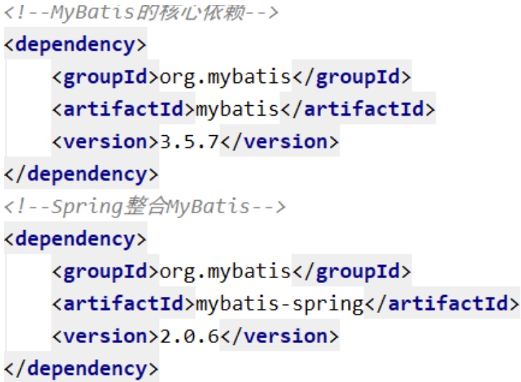

但是，在以上的依赖列表中，并没有MyBatis以及Spring整合MyBatis的依赖，因为当我们引入了MyBatis-Plus的依赖时，就可以间接的引入这些依赖
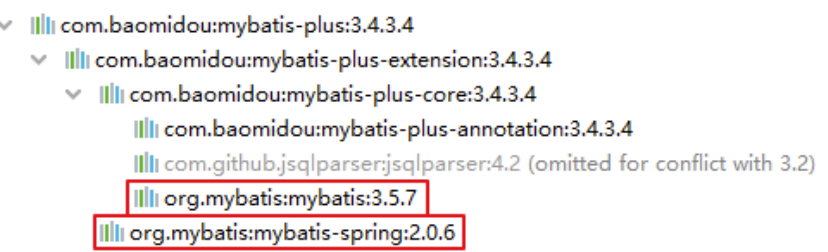

并且依赖和依赖之间的版本必须兼容，所以我们不能随便引入其他版本的依赖，以免发生冲突在官网上有明确提示：


## 4、【Spring】Spring整合MyBatis

### a>创建实体
```java
public class User {
    private Long id;
    private String name;
    private Integer age;
    private String email;
```

### b>创建MyBatis的核心配置文件
在resources下创建mybatis-config.xml
```xml
<?xml version="1.0" encoding="UTF-8" ?>
<!DOCTYPE configuration
        PUBLIC "-//mybatis.org//DTD Config 3.0//EN"
        "http://mybatis.org/dtd/mybatis-3-config.dtd">
<configuration>
</configuration>
```

### c>创建mapper接口和映射文件

#### mapper接口：
```java
public interface TestMapper {
    /**
     * 查询所有用户信息
     * @return
     */
    List<User> getAllUser();
}
```

#### mapper映射文件：
在resources下的com/atguigu/mp/mapper目录下创建TestMapper.xml
```xml
<?xml version="1.0" encoding="UTF-8" ?>
<!DOCTYPE mapper
        PUBLIC "-//mybatis.org//DTD Mapper 3.0//EN"
        "http://mybatis.org/dtd/mybatis-3-mapper.dtd">
<mapper namespace="com.atguigu.mp.mapper.TestMapper">
    <!--SQL片段，记录基础字段-->
    <sql id="BaseColumns">id,name,age,email</sql>
    <!--List<User> getAllUser();-->
    <select id="getAllUser" resultType="User">
    select <include refid="BaseColumns"></include> from user
    </select>
</mapper>
```

### d>创建jdbc.properties
在resources下创建jdbc.properties
```properties
jdbc.driver=com.mysql.jdbc.Driver
jdbc.url=jdbc:mysql://localhost:3306/mybatis_plus?useUnicode=true&characterEncoding=utf-8&useSSL=false
jdbc.username=root
jdbc.password=123456
```

### e>创建Spring的配置文件
在resources下创建applicationContext.xml
```xml
<?xml version="1.0" encoding="UTF-8"?>
<beans xmlns="http://www.springframework.org/schema/beans" xmlns:xsi="http://www.w3.org/2001/XMLSchema-instance" xmlns:context="http://www.springframework.org/schema/context" xsi:schemaLocation="http://www.springframework.org/schema/beans
http://www.springframework.org/schema/beans/spring-beans.xsd
http://www.springframework.org/schema/context
https://www.springframework.org/schema/context/spring-context.xsd">
    <!-- 引入jdbc.properties -->
    <context:property-placeholder location="classpath:jdbc.properties"></context:property-placeholder>
    <!-- 配置Druid数据源 -->
    <bean id="dataSource" class="com.alibaba.druid.pool.DruidDataSource">
        <property name="driverClassName" value="${jdbc.driver}"></property>
        <property name="url" value="${jdbc.url}"></property>
        <property name="username" value="${jdbc.username}"></property>
        <property name="password" value="${jdbc.password}"></property>
    </bean>
    <!-- 配置用于创建SqlSessionFactory的工厂bean -->
    <bean class="org.mybatis.spring.SqlSessionFactoryBean">
        <!-- 设置MyBatis配置文件的路径（可以不设置） -->
        <property name="configLocation" value="classpath:mybatis-config.xml"></property>
        <!-- 设置数据源 -->
        <property name="dataSource" ref="dataSource"></property>
        <!-- 设置类型别名所对应的包 -->
        <property name="typeAliasesPackage" value="com.atguigu.mp.pojo"></property>
        <!--
        设置映射文件的路径
        若映射文件所在路径和mapper接口所在路径一致，则不需要设置
        -->
        <!--
        <property name="mapperLocations" value="classpath:mapper/*.xml">
        </property>
        -->
    </bean>
    <!--
    配置mapper接口的扫描配置
    由mybatis-spring提供，可以将指定包下所有的mapper接口创建动态代理
    并将这些动态代理作为IOC容器的bean管理
    -->
    <bean class="org.mybatis.spring.mapper.MapperScannerConfigurer">
        <property name="basePackage" value="com.atguigu.mp.mapper"></property>
    </bean>
</beans>
```

### f>添加日志功能
在resources下创建logback.xml
```xml
<?xml version="1.0" encoding="UTF-8"?>
<configuration debug="false">
    <!--定义日志文件的存储地址 logs为当前项目的logs目录 还可以设置为../logs -->
    <property name="LOG_HOME" value="logs" />
    <!--控制台日志， 控制台输出 -->
    <appender name="STDOUT" class="ch.qos.logback.core.ConsoleAppender">
        <encoder class="ch.qos.logback.classic.encoder.PatternLayoutEncoder">
            <!--格式化输出：%d表示日期，%thread表示线程名，%-5level：级别从左显示5个字符宽度,%msg：日志消息，%n是换行符-->
            <pattern>%d{yyyy-MM-dd HH:mm:ss.SSS} [%thread] %-5level %logger{50} - %msg%n</pattern>
        </encoder>
    </appender>
    <!--myibatis log configure-->
    <logger name="com.apache.ibatis" level="TRACE" />
    <logger name="java.sql.Connection" level="DEBUG" />
    <logger name="java.sql.Statement" level="DEBUG" />
    <logger name="java.sql.PreparedStatement" level="DEBUG" />
    <!-- 日志输出级别 -->
    <root level="DEBUG">
        <appender-ref ref="STDOUT" />
    </root>
</configuration>
```

### g>测试

#### 方式一：通过IOC容器
```java
public class MyBatisPlusTest {
@Test
public void testMyBatis(){
    ApplicationContext ac = new ClassPathXmlApplicationContext("applicationContext.xml");
    TestMapper mapper = ac.getBean(TestMapper.class);
    mapper.getAllUser().forEach(user -> System.out.println(user));
    }
}
```

#### 方式二：Spring整合junit
```java
//在Spring的环境中进行测试
@RunWith(SpringJUnit4ClassRunner.class)
//指定Spring的配置文件
@ContextConfiguration("classpath:applicationContext.xml")
public class MyBatisPlusTest {
    @Autowired
    private TestMapper testMapper;
    @Test
    public void testMyBatisBySpring(){
        testMapper.getAllUser().forEach(user -> System.out.println(user));
    }
}
```

#### 结果：
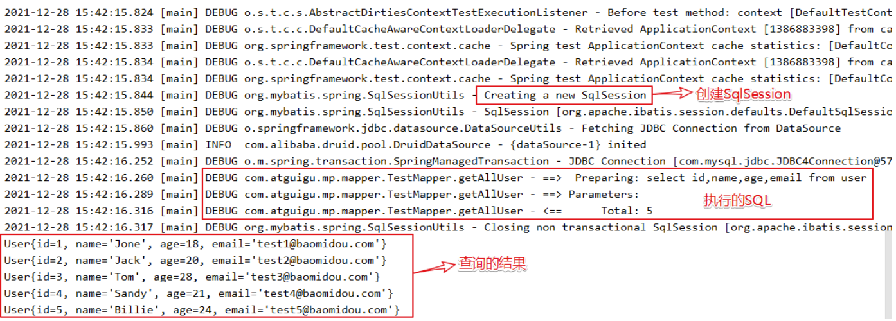


## 5、【Spring】加入MyBatis-Plus

### a>修改applicationContext.xml
Spring整合MyBatis
```xml
<!-- 配置用于创建SqlSessionFactory的工厂bean -->
<bean class="org.mybatis.spring.SqlSessionFactoryBean">
    <!-- 设置MyBatis配置文件的路径（可以不设置） -->
    <property name="configLocation" value="classpath:mybatis-config.xml"></property>
    <!-- 设置数据源 -->
    <property name="dataSource" ref="dataSource"></property>
    <!-- 设置类型别名所对应的包 -->
    <property name="typeAliasesPackage" value="com.atguigu.mp.pojo"></property>
    <!--
        设置映射文件的路径
        若映射文件所在路径和mapper接口所在路径一致，则不需要设置
    -->
    <!--
    <property name="mapperLocations" value="classpath:mapper/*.xml">
    </property>
    -->
</bean>
```

加入MyBatis-Plus之后
```xml
<!-- 此处使用的是MybatisSqlSessionFactoryBean -->
<bean class="com.baomidou.mybatisplus.extension.spring.MybatisSqlSessionFactoryBean">
    <!-- 设置MyBatis配置文件的路径（可以不设置） -->
    <property name="configLocation" value="classpath:mybatis-config.xml"></property>
    <!-- 设置数据源 -->
    <property name="dataSource" ref="dataSource"></property>
    <!-- 设置类型别名所对应的包 -->
    <property name="typeAliasesPackage" value="com.atguigu.mp.pojo"></property>
    <!--
        设置映射文件的路径
        若映射文件所在路径和mapper接口所在路径一致，则不需要设置
    -->
    <!--
    <property name="mapperLocations" value="classpath:mapper/*.xml">
    </property>
    -->
</bean>
```

> 此处使用的是MybatisSqlSessionFactoryBean
> 经观察，目前bean中配置的属性和SqlSessionFactoryBean一致
> MybatisSqlSessionFactoryBean是在SqlSessionFactoryBean的基础上进行了增强
> 即具有SqlSessionFactoryBean的基础功能，又具有MyBatis-Plus的扩展配置
> 具体配置信息地址：https://baomidou.com/pages/56bac0/#%E5%9F%BA%E6%9C%AC%E9%85%8D%E7%BD%AE

### b>创建mapper接口
```java
public interface UserMapper extends BaseMapper<User> {
}
```

> BaseMapper是MyBatis-Plus提供的基础mapper接口，泛型为所操作的实体类型，其中包含CRUD的各个方法，我们的mapper继承了BaseMapper之后，就可以直接使用BaseMapper所提供的各种方法，而不需要编写映射文件以及SQL语句，大大的提高了开发效率

### c>测试
```java
@RunWith(SpringJUnit4ClassRunner.class)
@ContextConfiguration("classpath:applicationContext.xml")
public class MyBatisPlusTest {
    @Autowired
    private UserMapper userMapper;
    @Test
    public void testMyBatisPlus(){
        //根据id查询用户信息
        System.out.println(userMapper.selectById(1));
    }
}
```

### d>结果
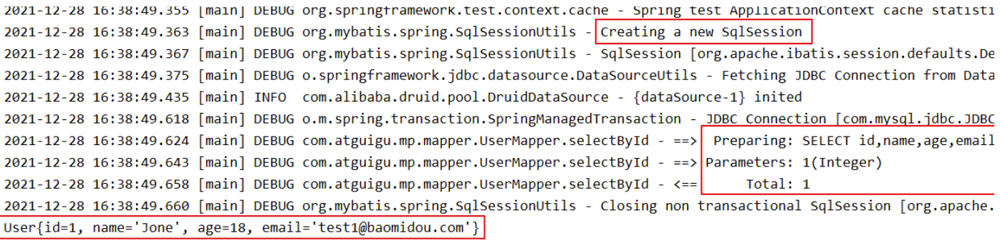


## 6、【Spring】总结
> 在Spring整合MyBatis中加入了MyBatis-Plus后，我们就可以使用MyBatis-Plus所提供的BaseMapper实现CRUD，并不需要编写映射文件以及SQL语句
> 但是若要自定义SQL语句，仍然可以编写映射文件而不造成任何影响
> 因为MyBatis-Plus只做增强，而不做改变


# 三、基本CRUD

## 1、BaseMapper
MyBatis-Plus中的基本CRUD在内置的BaseMapper中都已得到了实现，我们可以直接使用，接口如下：
```java
package com.baomidou.mybatisplus.core.mapper;

/**
 * Mapper 继承该接口后，无需编写 mapper.xml 文件，即可获得CRUD功能
 * <p>这个 Mapper 支持 id 泛型</p>
 *
 * @author hubin
 * @since 2016-01-23
 */
public interface BaseMapper<T> extends Mapper<T> {

    /**
     * 插入一条记录
     *
     * @param entity 实体对象
     */
    int insert(T entity);

    /**
     * 根据 ID 删除
     *
     * @param id 主键ID
     */
    int deleteById(Serializable id);

    /**
     * 根据实体(ID)删除
     *
     * @param entity 实体对象
     * @since 3.4.4
     */
    int deleteById(T entity);

    /**
     * 根据 columnMap 条件，删除记录
     *
     * @param columnMap 表字段 map 对象
     */
    int deleteByMap(@Param(Constants.COLUMN_MAP) Map<String, Object> columnMap);

    /**
     * 根据 entity 条件，删除记录
     *
     * @param queryWrapper 实体对象封装操作类（可以为 null,里面的 entity 用于生成 where 语句）
     */
    int delete(@Param(Constants.WRAPPER) Wrapper<T> queryWrapper);

    /**
     * 删除（根据ID或实体 批量删除）
     *
     * @param idList 主键ID列表或实体列表(不能为 null 以及 empty)
     */
    int deleteBatchIds(@Param(Constants.COLLECTION) Collection<?> idList);

    /**
     * 根据 ID 修改
     *
     * @param entity 实体对象
     */
    int updateById(@Param(Constants.ENTITY) T entity);

    /**
     * 根据 whereEntity 条件，更新记录
     *
     * @param entity        实体对象 (set 条件值,可以为 null)
     * @param updateWrapper 实体对象封装操作类（可以为 null,里面的 entity 用于生成 where 语句）
     */
    int update(@Param(Constants.ENTITY) T entity, @Param(Constants.WRAPPER) Wrapper<T> updateWrapper);

    /**
     * 根据 ID 查询
     *
     * @param id 主键ID
     */
    T selectById(Serializable id);

    /**
     * 查询（根据ID 批量查询）
     *
     * @param idList 主键ID列表(不能为 null 以及 empty)
     */
    List<T> selectBatchIds(@Param(Constants.COLLECTION) Collection<? extends Serializable> idList);

    /**
     * 查询（根据 columnMap 条件）
     *
     * @param columnMap 表字段 map 对象
     */
    List<T> selectByMap(@Param(Constants.COLUMN_MAP) Map<String, Object> columnMap);

    /**
     * 根据 entity 条件，查询一条记录
     * <p>查询一条记录，例如 qw.last("limit 1") 限制取一条记录, 注意：多条数据会报异常</p>
     *
     * @param queryWrapper 实体对象封装操作类（可以为 null）
     */
    default T selectOne(@Param(Constants.WRAPPER) Wrapper<T> queryWrapper) {
        List<T> ts = this.selectList(queryWrapper);
        if (CollectionUtils.isNotEmpty(ts)) {
            if (ts.size() != 1) {
                throw ExceptionUtils.mpe("One record is expected, but the query result is multiple records");
            }
            return ts.get(0);
        }
        return null;
    }

    /**
     * 根据 Wrapper 条件，判断是否存在记录
     *
     * @param queryWrapper 实体对象封装操作类
     * @return
     */
    default boolean exists(Wrapper<T> queryWrapper) {
        Long count = this.selectCount(queryWrapper);
        return null != count && count > 0;
    }

    /**
     * 根据 Wrapper 条件，查询总记录数
     *
     * @param queryWrapper 实体对象封装操作类（可以为 null）
     */
    Long selectCount(@Param(Constants.WRAPPER) Wrapper<T> queryWrapper);

    /**
     * 根据 entity 条件，查询全部记录
     *
     * @param queryWrapper 实体对象封装操作类（可以为 null）
     */
    List<T> selectList(@Param(Constants.WRAPPER) Wrapper<T> queryWrapper);

    /**
     * 根据 Wrapper 条件，查询全部记录
     *
     * @param queryWrapper 实体对象封装操作类（可以为 null）
     */
    List<Map<String, Object>> selectMaps(@Param(Constants.WRAPPER) Wrapper<T> queryWrapper);

    /**
     * 根据 Wrapper 条件，查询全部记录
     * <p>注意： 只返回第一个字段的值</p>
     *
     * @param queryWrapper 实体对象封装操作类（可以为 null）
     */
    List<Object> selectObjs(@Param(Constants.WRAPPER) Wrapper<T> queryWrapper);

    /**
     * 根据 entity 条件，查询全部记录（并翻页）
     *
     * @param page         分页查询条件（可以为 RowBounds.DEFAULT）
     * @param queryWrapper 实体对象封装操作类（可以为 null）
     */
    <P extends IPage<T>> P selectPage(P page, @Param(Constants.WRAPPER) Wrapper<T> queryWrapper);

    /**
     * 根据 Wrapper 条件，查询全部记录（并翻页）
     *
     * @param page         分页查询条件
     * @param queryWrapper 实体对象封装操作类
     */
    <P extends IPage<Map<String, Object>>> P selectMapsPage(P page, @Param(Constants.WRAPPER) Wrapper<T> queryWrapper);
}
```


## 2、插入
```java
@Test
public void testInsert(){
    User user = new User(null, "张三", 23, "zhangsan@atguigu.com");
    //INSERT INTO user ( id, name, age, email ) VALUES ( ?, ?, ?, ? )
    int result = userMapper.insert(user);
    System.out.println("受影响行数："+result);
    //1475754982694199298
    System.out.println("id自动获取："+user.getId());
}
```

> 最终执行的结果，所获取的id为1475754982694199298
> 这是因为MyBatis-Plus在实现插入数据时，会默认基于雪花算法的策略生成id


## 3、删除

### a>通过id删除记录
```java
@Test
public void testDeleteById(){
    //通过id删除用户信息
    //DELETE FROM user WHERE id=?
    int result = userMapper.deleteById(1475754982694199298L);
    System.out.println("受影响行数："+result);
}
```

### b>通过id批量删除记录
```java
@Test
public void testDeleteBatchIds(){
    //通过多个id批量删除
    //DELETE FROM user WHERE id IN ( ? , ? , ? )
    List<Long> idList = Arrays.asList(1L, 2L, 3L);
    int result = userMapper.deleteBatchIds(idList);
    System.out.println("受影响行数："+result);
}
```

### c>通过map条件删除记录
```java
@Test
public void testDeleteByMap(){
    //根据map集合中所设置的条件删除记录
    //DELETE FROM user WHERE name = ? AND age = ?
    Map<String, Object> map = new HashMap<>();
    map.put("age", 23);
    map.put("name", "张三");
    int result = userMapper.deleteByMap(map);
    System.out.println("受影响行数："+result);
}
```


## 4、修改
```java
@Test
public void testUpdateById(){
    User user = new User(4L, "admin", 22, null);
    //UPDATE user SET name=?, age=? WHERE id=?
    int result = userMapper.updateById(user);
    System.out.println("受影响行数："+result);
}
```


## 5、查询

### a>根据id查询用户信息
```java
@Test
public void testSelectById(){
    //根据id查询用户信息
    //SELECT id,name,age,email FROM user WHERE id=?
    User user = userMapper.selectById(4L);
    System.out.println(user);
}
```

### b>根据多个id查询多个用户信息
```java
@Test
public void testSelectBatchIds(){
    //根据多个id查询多个用户信息
    //SELECT id,name,age,email FROM user WHERE id IN ( ? , ? )
    List<Long> idList = Arrays.asList(4L, 5L);
    List<User> list = userMapper.selectBatchIds(idList);
    list.forEach(System.out::println);
}
```

### c>通过map条件查询用户信息
```java
@Test
public void testSelectByMap(){
    //通过map条件查询用户信息
    //SELECT id,name,age,email FROM user WHERE name = ? AND age = ?
    Map<String, Object> map = new HashMap<>();
    map.put("age", 22);
    map.put("name", "admin");
    List<User> list = userMapper.selectByMap(map);
    list.forEach(System.out::println);
}
```

### d>查询所有数据
```java
@Test
public void testSelectList(){
    //查询所有用户信息
    //SELECT id,name,age,email FROM user
    List<User> list = userMapper.selectList(null);
    list.forEach(System.out::println);
}
```

> 通过观察BaseMapper中的方法，大多方法中都有Wrapper类型的形参，此为条件构造器，可针对于SQL语句设置不同的条件，若没有条件，则可以为该形参赋值null，即查询（删除/修改）所有数据


## 6、通用Service
> 说明:
> 通用 Service CRUD 封装IService接口，进一步封装 CRUD 采用 get 查询单行 remove 删除 list 查询集合 page 分页 前缀命名方式区分 Mapper 层避免混淆，
> 泛型 T 为任意实体对象
> 建议如果存在自定义通用 Service 方法的可能，请创建自己的 IBaseService 继承 Mybatis-Plus 提供的基类
> 官网地址：https://baomidou.com/pages/49cc81/#service-crud-%E6%8E%A5%E5%8F%A3

### a>IService
MyBatis-Plus中有一个接口 IService和其实现类 ServiceImpl，封装了常见的业务层逻辑
详情查看源码IService和ServiceImpl

### b>创建Service接口和实现类
```java
/**
 * UserService继承IService模板提供的基础功能
 */
public interface UserService extends IService<User> {
}

/**
 * ServiceImpl实现了IService，提供了IService中基础功能的实现
 * 若ServiceImpl无法满足业务需求，则可以使用自定的UserService定义方法，并在实现类中实现
 */
@Service
public class UserServiceImpl extends ServiceImpl<UserMapper, User> implements UserService {
}
```

【Spring】
在applicationContext.xml中添加扫描组件的配置，扫描业务层组件，用于测试
```xml
<context:component-scan base-package="com.atguigu.mp.service.impl"></context:component-scan>
```

### c>测试查询记录数
```java
@Autowired
private UserService userService;
@Test
public void testGetCount(){
    long count = userService.count();
    System.out.println("总记录数：" + count);
}
```

### d>测试批量插入
```java
@Test
public void testSaveBatch(){
    // SQL长度有限制，海量数据插入单条SQL无法实行，
    // 因此MP将批量插入放在了通用Service中实现，而不是通用Mapper
    ArrayList<User> users = new ArrayList<>();
    for (int i = 0; i < 5; i++) {
        User user = new User();
        user.setName("ybc" + i);
        user.setAge(20 + i);
        users.add(user);
    }
    //SQL:INSERT INTO t_user ( username, age ) VALUES ( ?, ? )
    userService.saveBatch(users);
}
```


# 四、常用注解

## 1、@TableName
> 经过以上的测试，在使用MyBatis-Plus实现基本的CRUD时，我们并没有指定要操作的表，只是在Mapper接口继承BaseMapper时，设置了泛型User，而操作的表为user表
> 由此得出结论，MyBatis-Plus在确定操作的表时，由BaseMapper的泛型决定，即实体类型决定，且默认操作的表名和实体类型的类名一致

### a>问题
> 若实体类类型的类名和要操作的表的表名不一致，会出现什么问题？
> 我们将表user更名为t_user，测试查询功能
> 程序抛出异常，Table 'mybatis_plus.user' doesn't exist，因为现在的表名为t_user，而默认操作的表名和实体类型的类名一致，即user表

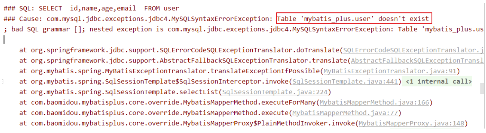

### b>通过@TableName解决问题
> 在实体类类型上添加@TableName("t_user")，标识实体类对应的表，即可成功执行SQL语句

```java
@TableName("t_user")
public class User {
```

### c>通过全局配置解决问题
> 在开发的过程中，我们经常遇到以上的问题，即实体类所对应的表都有固定的前缀，例如t_或tbl_
> 此时，可以使用MyBatis-Plus提供的全局配置，为实体类所对应的表名设置默认的前缀，那么就不需要在每个实体类上通过@TableName标识实体类对应的表

【SpringBoot】
```yml
mybatis-plus:
    configuration:
        # 配置MyBatis日志
        log-impl: org.apache.ibatis.logging.stdout.StdOutImpl
    global-config:
        db-config:
            # 配置MyBatis-Plus操作表的默认前缀
            table-prefix: t_
```

【Spring】
```xml
<bean class="com.baomidou.mybatisplus.extension.spring.MybatisSqlSessionFactoryBean">
    <property name="configLocation" value="classpath:mybatis-config.xml"></property>
    <property name="dataSource" ref="dataSource"></property>
    <property name="typeAliasesPackage" value="com.atguigu.mp.pojo"></property>
    <!-- 设置MyBatis-Plus的全局配置 -->
    <property name="globalConfig" ref="globalConfig"></property>
</bean>
<bean id="globalConfig" class="com.baomidou.mybatisplus.core.config.GlobalConfig">
    <property name="dbConfig">
        <bean class="com.baomidou.mybatisplus.core.config.GlobalConfig$DbConfig">
            <!-- 设置实体类所对应的表的前缀 -->
            <property name="tablePrefix" value="t_"></property>
        </bean>
    </property>
</bean>
```


## 2、@TableId
> 经过以上的测试，MyBatis-Plus在实现CRUD时，会默认将id作为主键列，并在插入数据时，默认基于雪花算法的策略生成id

### a>问题
> 若实体类和表中表示主键的不是id，而是其他字段，例如uid，MyBatis-Plus会自动识别uid为主键列吗？
> 我们实体类中的属性id改为uid，将表中的字段id也改为uid，测试添加功能
> 程序抛出异常，Field 'uid' doesn't have a default value，说明MyBatis-Plus没有将uid作为主键赋值

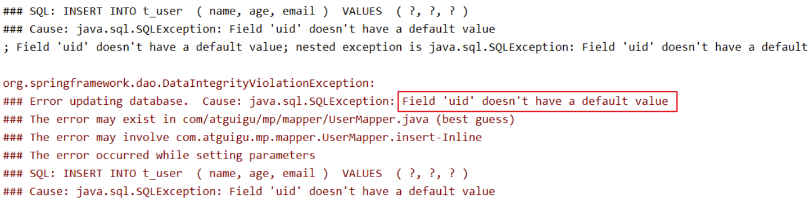

### b>通过@TableId解决问题
> 在实体类中uid属性上通过@TableId将其标识为主键，即可成功执行SQL语句

```java
public class User {
    @TableId
    private Long uid;
```

### c>@TableId的value属性
>  若实体类中主键对应的属性为id，而表中表示主键的字段为uid，此时若只在属性id上添加注解@TableId，则抛出异常Unknown column 'id' in 'field list'，即MyBatis-Plus仍然会将id作为表的主键操作，而表中表示主键的是字段uid
此时需要通过@TableId注解的value属性，指定表中的主键字段，@TableId("uid")或@TableId(value="uid")


### d>@TableId的type属性
> type属性用来定义主键策略

#### 常用的主键策略：
| 值                       | 描述                                                                 |
| ------------------------ | -------------------------------------------------------------------- |
| IdType.ASSIGN_ID（默认） | 基于雪花算法的策略生成数据id，与数据库id是否设置自增无关             |
| IdType.AUTO              | 使用数据库的自增策略，注意，该类型请确保数据库设置了id自增，否则无效 |

注意：无论使用了什么主键策略，当我们手动为主键赋值后，将以我们手动赋值结果为准。

#### 配置全局主键策略：
【SpringBoot】
```yml
mybatis-plus:
    configuration:
        # 配置MyBatis日志
        log-impl: org.apache.ibatis.logging.stdout.StdOutImpl
    global-config:
        db-config:
            # 配置MyBatis-Plus操作表的默认前缀
            table-prefix: t_
            # 配置MyBatis-Plus的主键策略
            id-type: auto
```

【Spring】
```xml
<bean class="com.baomidou.mybatisplus.extension.spring.MybatisSqlSessionFactoryBean">
    <property name="configLocation" value="classpath:mybatis-config.xml"></property>
    <property name="dataSource" ref="dataSource"></property>
    <property name="typeAliasesPackage" value="com.atguigu.mp.pojo"></property>
    <!-- 设置MyBatis-Plus的全局配置 -->
    <property name="globalConfig" ref="globalConfig"></property>
</bean>
<bean id="globalConfig" class="com.baomidou.mybatisplus.core.config.GlobalConfig">
    <property name="dbConfig">
        <bean class="com.baomidou.mybatisplus.core.config.GlobalConfig$DbConfig">
            <!-- 设置实体类所对应的表的前缀 -->
            <property name="tablePrefix" value="t_"></property>
            <!-- 设置全局主键策略 -->
            <property name="idType" value="AUTO"></property>
        </bean>
    </property>
</bean>
```

### e>雪花算法
- 背景
  - 需要选择合适的方案去应对数据规模的增长，以应对逐渐增长的访问压力和数据量。
  - 数据库的扩展方式主要包括：业务分库、主从复制（读写分离），数据库分表。
- 数据库分表
  - 将不同业务数据分散存储到不同的数据库服务器，能够支撑百万甚至千万用户规模的业务，但如果业务继续发展，同一业务的单表数据也会达到单台数据库服务器的处理瓶颈。例如，淘宝的几亿用户数据，如果全部存放在一台数据库服务器的一张表中，肯定是无法满足性能要求的，此时就需要对单表数据进行拆分。
  - 单表数据拆分有两种方式：垂直分表和水平分表。示意图如下：
    - 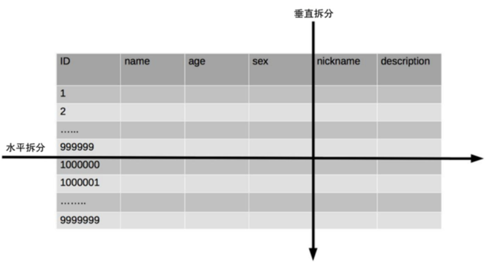

两种拆分方式
- 垂直分表
  - 垂直分表适合将表中某些不常用且占了大量空间的列拆分出去。
  - 例如，前面示意图中的 nickname 和 description 字段，假设我们是一个婚恋网站，用户在筛选其他用户的时候，主要是用 age 和 sex 两个字段进行查询，而 nickname 和 description 两个字段主要用于展示，一般不会在业务查询中用到。description 本身又比较长，因此我们可以将这两个字段独立到另外一张表中，这样在查询 age 和 sex 时，就能带来一定的性能提升。
- 水平分表
  - 水平分表适合表行数特别大的表，有的公司要求单表行数超过 5000 万就必须进行分表，这个数字可以作为参考，但并不是绝对标准，关键还是要看表的访问性能。对于一些比较复杂的表，可能超过 1000 万就要分表了；而对于一些简单的表，即使存储数据超过 1 亿行，也可以不分表。
  - 但不管怎样，当看到表的数据量达到千万级别时，作为架构师就要警觉起来，因为这很可能是架构的性能瓶颈或者隐患。
  - 水平分表相比垂直分表，会引入更多的复杂性，例如要求全局唯一的数据id该如何处理

id处理
- 主键自增
  - ①以最常见的用户 ID 为例，可以按照 1000000 的范围大小进行分段，1 ~ 999999 放到表 1中，1000000 ~ 1999999 放到表2中，以此类推。
  - ②复杂点：分段大小的选取。分段太小会导致切分后子表数量过多，增加维护复杂度；分段太大可能会导致单表依然存在性能问题，一般建议分段大小在 100 万至 2000 万之间，具体需要根据业务选取合适的分段大小。
  - ③优点：可以随着数据的增加平滑地扩充新的表。例如，现在的用户是 100 万，如果增加到 1000 万，只需要增加新的表就可以了，原有的数据不需要动。
  - ④缺点：分布不均匀。假如按照 1000 万来进行分表，有可能某个分段实际存储的数据量只有 1 条，而另外一个分段实际存储的数据量有 1000 万条。
- 取模
  - ①同样以用户 ID 为例，假如我们一开始就规划了 10 个数据库表，可以简单地用 user_id % 10 的值来表示数据所属的数据库表编号，ID 为 985 的用户放到编号为 5 的子表中，ID 为 10086 的用户放到编号为 6 的子表中。
  - ②复杂点：初始表数量的确定。表数量太多维护比较麻烦，表数量太少又可能导致单表性能存在问题。
  - ③优点：表分布比较均匀。
  - ④缺点：扩充新的表很麻烦，所有数据都要重分布。
- 雪花算法：雪花算法是由Twitter公布的分布式主键生成算法，它能够保证不同表的主键的不重复性，以及相同表的主键的有序性。
  - ①核心思想：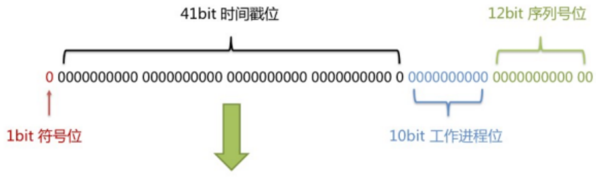
    - 长度共64bit（一个long型）。
    - 首先是一个符号位，1bit标识，由于long基本类型在Java中是带符号的，最高位是符号位，正数是0，负数是1，所以id一般是正数，最高位是0。
    - 41bit时间截(毫秒级)，存储的是时间截的差值（当前时间截 - 开始时间截)，结果约等于69.73年。
    - 10bit作为机器的ID（5个bit是数据中心，5个bit的机器ID，可以部署在1024个节点）。
    - 12bit作为毫秒内的流水号（意味着每个节点在每毫秒可以产生 4096 个 ID）。
  - ②优点：整体上按照时间自增排序，并且整个分布式系统内不会产生ID碰撞，并且效率较高。


## 3、@TableField
> 经过以上的测试，我们可以发现，MyBatis-Plus在执行SQL语句时，要保证实体类中的属性名和表中的字段名一致
> 如果实体类中的属性名和字段名不一致的情况，会出现什么问题呢？

### a>情况1
> 若实体类中的属性使用的是驼峰命名风格，而表中的字段使用的是下划线命名风格
> 例如实体类属性userName，表中字段user_name
> 此时MyBatis-Plus会自动将下划线命名风格转化为驼峰命名风格
> 相当于在MyBatis中配置

### b>情况2
> 若实体类中的属性和表中的字段不满足情况1
> 例如实体类属性name，表中字段username
> 此时需要在实体类属性上使用@TableField("username")设置属性所对应的字段名

```java
public class User {
    private Long id;
    @TableField("username")
    private String name;
```


## 4、@TableLogic

### a>逻辑删除
- 物理删除：真实删除，将对应数据从数据库中删除，之后查询不到此条被删除的数据
- 逻辑删除：假删除，将对应数据中代表是否被删除字段的状态修改为“被删除状态”，之后在数据库中仍旧能看到此条数据记录
- 使用场景：可以进行数据恢复

### b>实现逻辑删除

#### s1: 数据库中创建逻辑删除状态列，设置默认值为0
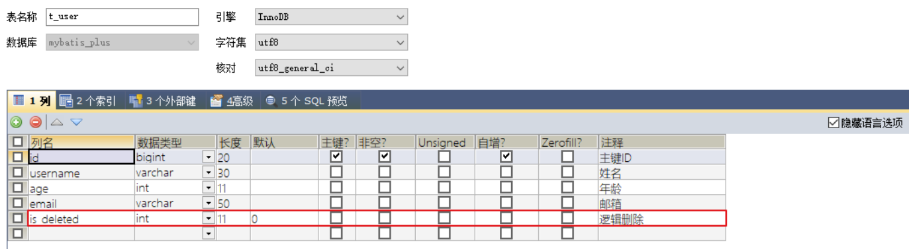

#### s2: 实体类中添加逻辑删除属性
```java
public class User {
    private Long id;
    @TableField("username")
    private String name;
    private Integer age;
    private String email;
    @TableLogic
    private Integer isDeleted;
}
```

#### s3: 测试
> 测试删除功能，真正执行的是修改
> UPDATE t_user SET is_deleted=1 WHERE id=? AND is_deleted=0
> 测试查询功能，被逻辑删除的数据默认不会被查询
> SELECT id,username AS name,age,email,is_deleted FROM t_user WHERE is_deleted=0


# 五、条件构造器和常用接口

## 1、wapper介绍
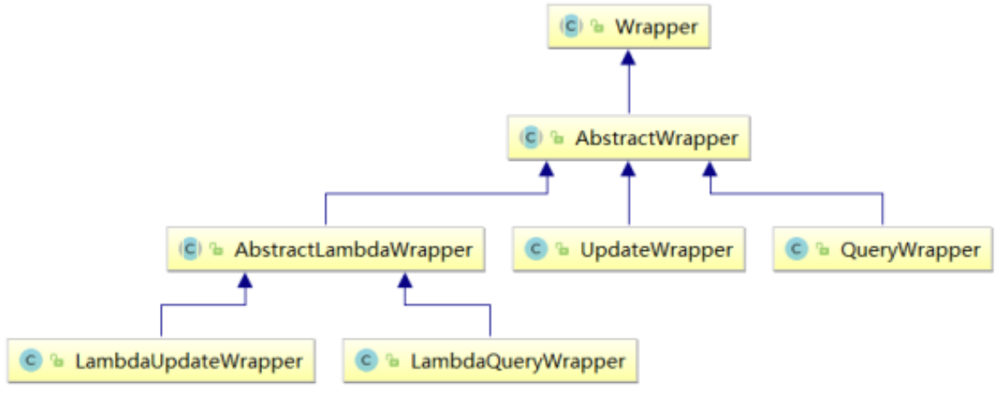
- Wrapper ： 条件构造抽象类，最顶端父类
  - AbstractWrapper ： 用于查询条件封装，生成 sql 的 where 条件
    - QueryWrapper ： 查询条件封装
    - UpdateWrapper ： Update 条件封装
    - AbstractLambdaWrapper ： 使用Lambda 语法
      - LambdaQueryWrapper ：用于Lambda语法使用的查询Wrapper
      - LambdaUpdateWrapper ： Lambda 更新封装Wrapper


## 2、QueryWrapper

### a>例1：组装查询条件
```java
@Test
public void test01(){
    //查询用户名包含a，年龄在20到30之间，并且邮箱不为null的用户信息
    //SELECT id,username AS name,age,email,is_deleted FROM t_user WHERE is_deleted=0 AND (username LIKE ? AND age BETWEEN ? AND ? AND email IS NOT NULL)
    QueryWrapper<User> queryWrapper = new QueryWrapper<>();
    queryWrapper.like("username", "a")
                .between("age", 20, 30)
                .isNotNull("email");
    List<User> list = userMapper.selectList(queryWrapper);
    list.forEach(System.out::println);
}
```

### b>例2：组装排序条件
```java
@Test
public void test02(){
    //按年龄降序查询用户，如果年龄相同则按id升序排列
    //SELECT id,username AS name,age,email,is_deleted FROM t_user WHERE is_deleted=0 ORDER BY age DESC,id ASC
    QueryWrapper<User> queryWrapper = new QueryWrapper<>();
    queryWrapper.orderByDesc("age")
                .orderByAsc("id");
    List<User> users = userMapper.selectList(queryWrapper);
    users.forEach(System.out::println);
}
```

### c>例3：组装删除条件
```java
@Test
public void test03(){
    //删除email为空的用户
    //DELETE FROM t_user WHERE (email IS NULL)
    QueryWrapper<User> queryWrapper = new QueryWrapper<>();
    queryWrapper.isNull("email");
    //条件构造器也可以构建删除语句的条件
    int result = userMapper.delete(queryWrapper);
    System.out.println("受影响的行数：" + result);
}
```

### d>例4：条件的优先级
```java
@Test
public void test04() {
    QueryWrapper<User> queryWrapper = new QueryWrapper<>();
    //将（年龄大于20并且用户名中包含有a）或邮箱为null的用户信息修改
    //UPDATE t_user SET age=?, email=? WHERE (username LIKE ? AND age > ? OR email IS NULL)
    queryWrapper.like("username", "a")
                .gt("age", 20)
                .or()
                .isNull("email");
    User user = new User();
    user.setAge(18);
    user.setEmail("user@atguigu.com");
    int result = userMapper.update(user, queryWrapper);
    System.out.println("受影响的行数：" + result);
}
```

```java
@Test
public void test04() {
    QueryWrapper<User> queryWrapper = new QueryWrapper<>();
    //将用户名中包含有a并且（年龄大于20或邮箱为null）的用户信息修改
    //UPDATE t_user SET age=?, email=? WHERE (username LIKE ? AND (age > ? OR email IS NULL))
    //lambda表达式内的逻辑优先运算
    queryWrapper.like("username", "a")
                .and(i -> i.gt("age", 20).or().isNull("email"));
    User user = new User();
    user.setAge(18);
    user.setEmail("user@atguigu.com");
    int result = userMapper.update(user, queryWrapper);
    System.out.println("受影响的行数：" + result);
}
```

### e>例5：组装select子句
```java
@Test
public void test05() {
    //查询用户信息的username和age字段
    //SELECT username,age FROM t_user
    QueryWrapper<User> queryWrapper = new QueryWrapper<>();
    queryWrapper.select("username", "age");
    //selectMaps()返回Map集合列表，通常配合select()使用，避免User对象中没有被查询到的列值为null
    List<Map<String, Object>> maps = userMapper.selectMaps(queryWrapper);
    maps.forEach(System.out::println);
}
```

### f>例6：实现子查询
```java
@Test
public void test06() {
    //查询id小于等于3的用户信息
    //SELECT id,username AS name,age,email,is_deleted FROM t_user WHERE (id IN (select id from t_user where id <= 3))
    QueryWrapper<User> queryWrapper = new QueryWrapper<>();
    queryWrapper.inSql("id", "select id from t_user where id <= 3");
    List<User> list = userMapper.selectList(queryWrapper);
    list.forEach(System.out::println);
}
```


## 3、UpdateWrapper
```java
@Test
public void test07() {
    //将（年龄大于20或邮箱为null）并且用户名中包含有a的用户信息修改
    //组装set子句以及修改条件
    UpdateWrapper<User> updateWrapper = new UpdateWrapper<>();
    //lambda表达式内的逻辑优先运算
    updateWrapper.set("age", 18)
                 .set("email", "user@atguigu.com")
                 .like("username", "a")
                 .and(i -> i.gt("age", 20).or().isNull("email"));
    //这里必须要创建User对象，否则无法应用自动填充。如果没有自动填充，可以设置为null
    //UPDATE t_user SET username=?, age=?,email=? WHERE (username LIKE ? AND (age > ? OR email IS NULL))
    //User user = new User();
    //user.setName("张三");
    //int result = userMapper.update(user, updateWrapper);
    //UPDATE t_user SET age=?,email=? WHERE (username LIKE ? AND (age > ? OR email IS NULL))
    int result = userMapper.update(null, updateWrapper);
    System.out.println(result);
}
```


## 4、condition
> 在真正开发的过程中，组装条件是常见的功能，而这些条件数据来源于用户输入，是可选的，因此我们在组装这些条件时，必须先判断用户是否选择了这些条件，若选择则需要组装该条件，若没有选择则一定不能组装，以免影响SQL执行的结果

#### 思路一：
```java
@Test
public void test08() {
    //定义查询条件，有可能为null（用户未输入或未选择）
    String username = null;
    Integer ageBegin = 10;
    Integer ageEnd = 24;
    QueryWrapper<User> queryWrapper = new QueryWrapper<>();
    //StringUtils.isNotBlank()判断某字符串是否不为空且长度不为0且不由空白符(whitespace)构成
    if(StringUtils.isNotBlank(username)){
        queryWrapper.like("username","a");
    }
    if(ageBegin != null){
        queryWrapper.ge("age", ageBegin);
    }
    if(ageEnd != null){
        queryWrapper.le("age", ageEnd);
    }
    //SELECT id,username AS name,age,email,is_deleted FROM t_user WHERE (age >= ? AND age <= ?)
    List<User> users = userMapper.selectList(queryWrapper);
    users.forEach(System.out::println);
}
```

#### 思路二：
> 上面的实现方案没有问题，但是代码比较复杂，我们可以使用带condition参数的重载方法构建查询条件，简化代码的编写

```java
@Test
public void test08UseCondition() {
    //定义查询条件，有可能为null（用户未输入或未选择）
    String username = null;
    Integer ageBegin = 10;
    Integer ageEnd = 24;
    QueryWrapper<User> queryWrapper = new QueryWrapper<>();
    //StringUtils.isNotBlank()判断某字符串是否不为空且长度不为0且不由空白符(whitespace)构成
    queryWrapper.like(StringUtils.isNotBlank(username), "username", "a")
                .ge(ageBegin != null, "age", ageBegin)
                .le(ageEnd != null, "age", ageEnd);
    //SELECT id,username AS name,age,email,is_deleted FROM t_user WHERE (age >= ? AND age <= ?)
    List<User> users = userMapper.selectList(queryWrapper);
    users.forEach(System.out::println);
}
```


## 5、LambdaQueryWrapper
```java
@Test
public void test09() {
    //定义查询条件，有可能为null（用户未输入）
    String username = "a";
    Integer ageBegin = 10;
    Integer ageEnd = 24;
    LambdaQueryWrapper<User> queryWrapper = new LambdaQueryWrapper<>();
    //避免使用字符串表示字段，防止运行时错误
    queryWrapper.like(StringUtils.isNotBlank(username), User::getName, username)
                .ge(ageBegin != null, User::getAge, ageBegin)
                .le(ageEnd != null, User::getAge, ageEnd);
    List<User> users = userMapper.selectList(queryWrapper);
    users.forEach(System.out::println);
}
```


## 6、LambdaUpdateWrapper
```java
@Test
public void test10() {
    //组装set子句
    LambdaUpdateWrapper<User> updateWrapper = new LambdaUpdateWrapper<>();
    updateWrapper.set(User::getAge, 18)
                 .set(User::getEmail, "user@atguigu.com")
                 .like(User::getName, "a")
                 .and(i -> i.lt(User::getAge, 24).or().isNull(User::getEmail)); //lambda表达式内的逻辑优先运算
    User user = new User();
    int result = userMapper.update(user, updateWrapper);
    System.out.println("受影响的行数：" + result);
}
```


# 六、插件

## 1、分页插件
> MyBatis Plus自带分页插件，只要简单的配置即可实现分页功能

### a>添加配置类
【SpringBoot】
```java
@Configuration
@MapperScan("com.atguigu.mybatisplus.mapper") //可以将主类中的注解移到此处
public class MybatisPlusConfig {
    @Bean
    public MybatisPlusInterceptor mybatisPlusInterceptor() {
        MybatisPlusInterceptor interceptor = new MybatisPlusInterceptor();
        interceptor.addInnerInterceptor(new PaginationInnerInterceptor(DbType.MYSQL));
        return interceptor;
    }
}
```

【Spring】
```xml
<bean class="com.baomidou.mybatisplus.extension.spring.MybatisSqlSessionFactoryBean">
    <property name="configLocation" value="classpath:mybatis-config.xml"></property>
    <property name="dataSource" ref="dataSource"></property>
    <property name="typeAliasesPackage" value="com.atguigu.mp.pojo"></property>
    <property name="globalConfig" ref="globalConfig"></property>
    <!--配置插件-->
    <property name="plugins">
        <array>
            <ref bean="mybatisPlusInterceptor"></ref>
        </array>
    </property>
</bean><!--配置MyBatis-Plus插件-->
<bean id="mybatisPlusInterceptor" class="com.baomidou.mybatisplus.extension.plugins.MybatisPlusInterceptor">
    <property name="interceptors">
        <list>
            <ref bean="paginationInnerInterceptor"></ref>
        </list>
    </property>
</bean><!--配置MyBatis-Plus分页插件的bean-->
<bean id="paginationInnerInterceptor" class="com.baomidou.mybatisplus.extension.plugins.inner.PaginationInnerInterceptor">
    <!--设置数据库类型-->
    <property name="dbType" value="MYSQL"></property>
</bean>
```

### b>测试
```java
@Test
public void testPage(){
    //设置分页参数
    Page<User> page = new Page<>(1, 5);
    userMapper.selectPage(page, null);
    //获取分页数据
    List<User> list = page.getRecords();
    list.forEach(System.out::println);
    System.out.println("当前页："+page.getCurrent());
    System.out.println("每页显示的条数："+page.getSize());
    System.out.println("总记录数："+page.getTotal());
    System.out.println("总页数："+page.getPages());
    System.out.println("是否有上一页："+page.hasPrevious());
    System.out.println("是否有下一页："+page.hasNext());
}
```

> 测试结果：
> User(id=1, name=Jone, age=18, email=test1@baomidou.com, isDeleted=0) 
> User(id=2, name=Jack, age=20, email=test2@baomidou.com, isDeleted=0) 
> User(id=3, name=Tom, age=28, email=test3@baomidou.com, isDeleted=0) 
> User(id=4, name=Sandy, age=21, email=test4@baomidou.com, isDeleted=0) 
> User(id=5, name=Billie, age=24, email=test5@baomidou.com, isDeleted=0) 
> 当前页：1 每页显示的条数：5 总记录数：17 总页数：4 是否有上一页：false 是否有下一页：true


## 2、xml自定义分页

### a>UserMapper中定义接口方法
```java
/**
 * 根据年龄查询用户列表，分页显示
 * @param page 分页对象,xml中可以从里面进行取值,传递参数 Page 即自动分页,必须放在第一位
 * @param age 年龄
 * @return
 */
IPage<User> selectPageVo(@Param("page") Page<User> page, @Param("age") Integer age);
```

### b>UserMapper.xml中编写SQL
```xml
<!--SQL片段，记录基础字段-->
<sql id="BaseColumns">id,username,age,email</sql>
<!--IPage<User> selectPageVo(Page<User> page, Integer age);-->
<!-- 我们此处虽然是自己编写sql，其实我们还是在使用mybatisplus的分页插件实现分页功能，我们不需要手动实现分页，此处传入的page对象就是方便我们实现分页的。 -->
<select id="selectPageVo" resultType="User">SELECT <include refid="BaseColumns"></include> FROM t_user WHERE age > #{age}</select>
```

### c>测试
```java
@Test
public void testSelectPageVo(){
    //设置分页参数
    Page<User> page = new Page<>(1, 5);
    userMapper.selectPageVo(page, 20);
    //获取分页数据
    List<User> list = page.getRecords();
    list.forEach(System.out::println);
    System.out.println("当前页："+page.getCurrent());
    System.out.println("每页显示的条数："+page.getSize());
    System.out.println("总记录数："+page.getTotal());
    System.out.println("总页数："+page.getPages());
    System.out.println("是否有上一页："+page.hasPrevious());
    System.out.println("是否有下一页："+page.hasNext());
}
```

> 结果：
> User(id=3, name=Tom, age=28, email=test3@baomidou.com, isDeleted=null) 
> User(id=4, name=Sandy, age=21, email=test4@baomidou.com, isDeleted=null) 
> User(id=5, name=Billie, age=24, email=test5@baomidou.com, isDeleted=null) 
> User(id=8, name=ybc1, age=21, email=null, isDeleted=null) 
> User(id=9, name=ybc2, age=22, email=null, isDeleted=null) 
> 当前页：1 每页显示的条数：5 总记录数：12 总页数：3 是否有上一页：false 是否有下一页：true


## 3、乐观锁

### a>场景
> 一件商品，成本价是80元，售价是100元。老板先是通知小李，说你去把商品价格增加50元。小李正在玩游戏，耽搁了一个小时。正好一个小时后，老板觉得商品价格增加到150元，价格太高，可能会影响销量。又通知小王，你把商品价格降低30元。
> 此时，小李和小王同时操作商品后台系统。小李操作的时候，系统先取出商品价格100元；小王也在操作，取出的商品价格也是100元。小李将价格加了50元，并将100+50=150元存入了数据库；小王将商品减了30元，并将100-30=70元存入了数据库。是的，如果没有锁，小李的操作就完全被小王的覆盖了。
> 现在商品价格是70元，比成本价低10元。几分钟后，这个商品很快出售了1千多件商品，老板亏1万多。

### b>乐观锁与悲观锁
> 上面的故事，如果是乐观锁，小王保存价格前，会检查下价格是否被人修改过了。如果被修改过了，则重新取出的被修改后的价格，150元，这样他会将120元存入数据库。
> 如果是悲观锁，小李取出数据后，小王只能等小李操作完之后，才能对价格进行操作，也会保证最终的价格是120元。

### c>模拟修改冲突

#### 数据库中增加商品表
```sql
CREATE TABLE t_product
(
    id BIGINT(20) NOT NULL COMMENT '主键ID',
    NAME VARCHAR(30) NULL DEFAULT NULL COMMENT '商品名称',
    price INT(11) DEFAULT 0 COMMENT '价格',
    VERSION INT(11) DEFAULT 0 COMMENT '乐观锁版本号',
    PRIMARY KEY (id)
);
```

#### 添加数据
```sql
INSERT INTO t_product (id, NAME, price) VALUES (1, '外星人笔记本', 100);
```

#### 添加实体
```java
package com.atguigu.mybatisplus.entity;
import lombok.Data;
@Data
public class Product {
    private Long id;
    private String name;
    private Integer price;
    private Integer version;
}
```

#### 添加mapper
```java
public interface ProductMapper extends BaseMapper<Product> {
}
```

#### 测试
```java
@Test
public void testConcurrentUpdate() {
    //1、小李
    Product p1 = productMapper.selectById(1L);
    System.out.println("小李取出的价格：" + p1.getPrice());
    //2、小王
    Product p2 = productMapper.selectById(1L);
    System.out.println("小王取出的价格：" + p2.getPrice());
    //3、小李将价格加了50元，存入了数据库
    p1.setPrice(p1.getPrice() + 50);
    int result1 = productMapper.updateById(p1);
    System.out.println("小李修改结果：" + result1);
    //4、小王将商品减了30元，存入了数据库
    p2.setPrice(p2.getPrice() - 30);
    int result2 = productMapper.updateById(p2);
    System.out.println("小王修改结果：" + result2);
    //最后的结果
    Product p3 = productMapper.selectById(1L);
    //价格覆盖，最后的结果：70
    System.out.println("最后的结果：" + p3.getPrice());
}
```

### d>乐观锁实现流程
> 数据库中添加version字段
> 取出记录时，获取当前version
> ```sql
> SELECT id,`name`,price,`version` FROM product WHERE id=1
> ```
> 更新时，version + 1，如果where语句中的version版本不对，则更新失败
> ```sql
> UPDATE product SET price=price+50, `version`=`version` + 1 WHERE id=1 AND `version`=1
> ```

### e>Mybatis-Plus实现乐观锁

#### 修改实体类
```java
package com.atguigu.mybatisplus.entity;
import com.baomidou.mybatisplus.annotation.Version;
import lombok.Data;
@Data
public class Product {
    private Long id;
    private String name;
    private Integer price;
    @Version
    private Integer version;
}
```

#### 添加乐观锁插件配置
【SpringBoot】
```java
@Bean
public MybatisPlusInterceptor mybatisPlusInterceptor(){
    MybatisPlusInterceptor interceptor = new MybatisPlusInterceptor();
    //添加分页插件
    interceptor.addInnerInterceptor(new PaginationInnerInterceptor(DbType.MYSQL));
    //添加乐观锁插件
    interceptor.addInnerInterceptor(new OptimisticLockerInnerInterceptor());
    return interceptor;
}
```

【Spring】
```xml
<!--配置MyBatis-Plus插件-->
<bean id="mybatisPlusInterceptor" class="com.baomidou.mybatisplus.extension.plugins.MybatisPlusInterceptor">
    <property name="interceptors">
        <list>
            <ref bean="paginationInnerInterceptor"></ref>
            <ref bean="optimisticLockerInnerInterceptor"></ref>
        </list>
    </property>
</bean>
<!--配置乐观锁插件-->
<bean id="optimisticLockerInnerInterceptor" class="com.baomidou.mybatisplus.extension.plugins.inner.OptimisticLockerInnerInterceptor"></bean>
```

#### 测试修改冲突
> 小李查询商品信息：
> SELECT id,name,price,version FROM t_product WHERE id=?
> 小王查询商品信息：
> SELECT id,name,price,version FROM t_product WHERE id=?
> 小李修改商品价格，自动将version+1
> UPDATE t_product SET name=?, price=?, version=? WHERE id=? AND version=?
> Parameters: 外星人笔记本(String), 150(Integer), 1(Integer), 1(Long), 0(Integer)
> 小王修改商品价格，此时version已更新，条件不成立，修改失败
> UPDATE t_product SET name=?, price=?, version=? WHERE id=? AND version=?
> Parameters: 外星人笔记本(String), 70(Integer), 1(Integer), 1(Long), 0(Integer)
> 最终，小王修改失败，查询价格：150
> SELECT id,name,price,version FROM t_product WHERE id=?


#### 优化流程
```java
@Test
public void testConcurrentVersionUpdate() {
    //小李取数据
    Product p1 = productMapper.selectById(1L);
    //小王取数据
    Product p2 = productMapper.selectById(1L);
    //小李修改 + 50
    p1.setPrice(p1.getPrice() + 50);
    int result1 = productMapper.updateById(p1);
    System.out.println("小李修改的结果：" + result1);
    //小王修改 - 30
    p2.setPrice(p2.getPrice() - 30);
    int result2 = productMapper.updateById(p2);
    System.out.println("小王修改的结果：" + result2);
    if(result2 == 0){
        //失败重试，重新获取version并更新
        p2 = productMapper.selectById(1L);
        p2.setPrice(p2.getPrice() - 30);
        result2 = productMapper.updateById(p2);
    }
    System.out.println("小王修改重试的结果：" + result2);
    //老板看价格
    Product p3 = productMapper.selectById(1L);
    System.out.println("老板看价格：" + p3.getPrice());
}
```


# 七、通用枚举
>  表中的有些字段值是固定的，例如性别（男或女），此时我们可以使用MyBatis-Plus的通用枚举来实现

### a>数据库表添加字段sex
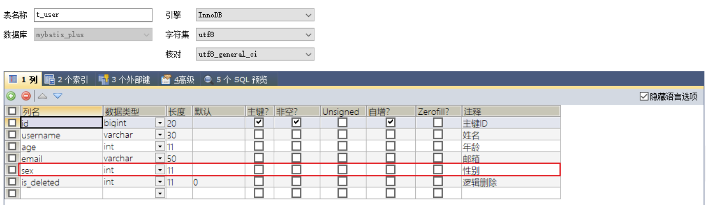

### b>创建通用枚举类型
```java
package com.atguigu.mp.enums;
import com.baomidou.mybatisplus.annotation.EnumValue;
import lombok.Getter;
@Getter
public enum SexEnum {
    MALE(1, "男"),
    FEMALE(2, "女");
    @EnumValue
    private Integer sex;
    private String sexName;
    SexEnum(Integer sex, String sexName) {
        this.sex = sex;
        this.sexName = sexName;
    }
}
```

### c>配置扫描通用枚举
【SpringBoot】
```yml
mybatis-plus:
    configuration:
        # 配置MyBatis日志
        log-impl: org.apache.ibatis.logging.stdout.StdOutImpl
    global-config:
        db-config:
            # 配置MyBatis-Plus操作表的默认前缀
            table-prefix: t_
            # 配置MyBatis-Plus的主键策略
            id-type: auto
    # 配置扫描通用枚举
    type-enums-package: com.atguigu.mybatisplus.enums
```

【Spring】
```xml
<bean class="com.baomidou.mybatisplus.extension.spring.MybatisSqlSessionFactoryBean">
    <property name="configLocation" value="classpath:mybatis-config.xml"></property>
    <property name="dataSource" ref="dataSource"></property>
    <property name="typeAliasesPackage" value="com.atguigu.mp.pojo"></property>
    <!-- 设置MyBatis-Plus的全局配置 -->
    <property name="globalConfig" ref="globalConfig"></property>
    <!-- 配置扫描通用枚举 -->
    <property name="typeEnumsPackage" value="com.atguigu.mp.enums"></property>
</bean>
```

### d>测试
```java
@Test
public void testSexEnum(){
    User user = new User();
    user.setName("Enum");
    user.setAge(20);
    //设置性别信息为枚举项，会将@EnumValue注解所标识的属性值存储到数据库。如果不设置则将枚举的name存储到数据库
    user.setSex(SexEnum.MALE);
    //INSERT INTO t_user ( username, age, sex ) VALUES ( ?, ?, ? )
    //Parameters: Enum(String), 20(Integer), 1(Integer)
    userMapper.insert(user);
}
```


# 八、代码生成器

## 1、引入依赖
```xml
<dependency>
    <groupId>com.baomidou</groupId>
    <artifactId>mybatis-plus-generator</artifactId>
    <version>3.5.1</version>
</dependency>
<dependency>
    <groupId>org.freemarker</groupId>
    <artifactId>freemarker</artifactId>
    <version>2.3.31</version>
</dependency>
```


## 2、快速生成
```java
public class FastAutoGeneratorTest {
    public static void main(String[] args) {
        FastAutoGenerator
                .create("jdbc:mysql://127.0.0.1:3306/mybatis_plus?characterEncoding=utf-8&userSSL=false", "root", "123456")
                .globalConfig(builder -> {
                    builder.author("atguigu") // 设置作者
                            // .enableSwagger() // 开启 swagger 模式
                            .fileOverride() // 覆盖已生成文件
                            .outputDir("D://mybatis_plus"); // 指定输出目录
                })
                .packageConfig(builder -> {
                    builder.parent("com.atguigu") // 设置父包名
                            .moduleName("mybatisplus") // 设置父包模块名
                            .pathInfo(Collections.singletonMap(OutputFile.mapperXml, "D://mybatis_plus"));
                    // 设置mapperXml生成路径
                })
                .strategyConfig(builder -> {
                    builder.addInclude("t_user") // 设置需要生成的表名
                           .addTablePrefix("t_", "c_"); // 设置过滤表前缀
                })
                .templateEngine(new FreemarkerTemplateEngine()) // 使用Freemarker引擎模板，默认的是Velocity引擎模板
                .execute();
    }
}
```


# 九、多数据源
> 适用于多种场景：纯粹多库、 读写分离、 一主多从、 混合模式等
> 目前我们就来模拟一个纯粹多库的一个场景，其他场景类似
> 场景说明：
> 我们创建两个库，分别为：mybatis_plus（以前的库不动）与mybatis_plus_1（新建），将mybatis_plus库的product表移动到mybatis_plus_1库，这样每个库一张表，通过一个测试用例分别获取用户数据与商品数据，如果获取到说明多库模拟成功

## 1、创建数据库及表
> 创建数据库mybatis_plus_1和表product

```sql
CREATE DATABASE `mybatis_plus_1` /*!40100 DEFAULT CHARACTER SET utf8mb4 */;
use `mybatis_plus_1`;
CREATE TABLE product
(
    id BIGINT(20) NOT NULL COMMENT '主键ID',
    name VARCHAR(30) NULL DEFAULT NULL COMMENT '商品名称',
    price INT(11) DEFAULT 0 COMMENT '价格',
    version INT(11) DEFAULT 0 COMMENT '乐观锁版本号',
    PRIMARY KEY (id)
);
```

> 添加测试数据

```sql
INSERT INTO product (id, NAME, price) VALUES (1, '外星人笔记本', 100);
```

> 删除mybatis_plus库product表

```sql
use mybatis_plus;
DROP TABLE IF EXISTS product;
```


## 2、引入依赖
```xml
<dependency>
    <groupId>com.baomidou</groupId>
    <artifactId>dynamic-datasource-spring-boot-starter</artifactId>
    <version>3.5.0</version>
</dependency>
```


## 3、配置多数据源
> 说明：注释掉之前的数据库连接，添加新配置

```yml
spring:
    # 配置数据源信息
    datasource:
        dynamic:
            # 设置默认的数据源或者数据源组,默认值即为master
            primary: master
            # 严格匹配数据源,默认false.true未匹配到指定数据源时抛异常,false使用默认数据源
            strict: false
            datasource:
                master:
                    url: jdbc:mysql://localhost:3306/mybatis_plus?characterEncoding=utf-8&useSSL=false
                    driver-class-name: com.mysql.cj.jdbc.Driver
                    username: root
                    password: 123456
                slave_1:
                    url: jdbc:mysql://localhost:3306/mybatis_plus_1?characterEncoding=utf-8&useSSL=false
                    driver-class-name: com.mysql.cj.jdbc.Driver
                    username: root
                    password: 123456
```


## 4、创建用户service
```java
public interface UserService extends IService<User> {
}
```

```java
@DS("master") //指定所操作的数据源
@Service
public class UserServiceImpl extends ServiceImpl<UserMapper, User> implements UserService {
}
```


## 5、创建商品service
```java
public interface ProductService extends IService<Product> {
}
```

```java
@DS("slave_1")
@Service
public class ProductServiceImpl extends ServiceImpl<ProductMapper, Product> implements ProductService {
}
```


## 6、测试
```java
@Autowired
private UserService userService;
@Autowired
private ProductService productService;
@Test
public void testDynamicDataSource(){
    System.out.println(userService.getById(1L));
    System.out.println(productService.getById(1L));
}
```

> 结果：
> 1、都能顺利获取对象，则测试成功
> 2、如果我们实现读写分离，将写操作方法加上主库数据源，读操作方法加上从库数据源，自动切换，是不是就能实现读写分离？


# 十、MyBatisX插件
> MyBatis-Plus为我们提供了强大的mapper和service模板，能够大大的提高开发效率
> 但是在真正开发过程中，MyBatis-Plus并不能为我们解决所有问题，例如一些复杂的SQL，多表联查，我们就需要自己去编写代码和SQL语句，我们该如何快速的解决这个问题呢，这个时候可以使用MyBatisX插件
> MyBatisX一款基于 IDEA 的快速开发插件，为效率而生。

MyBatisX插件用法：https://baomidou.com/pages/ba5b24/
