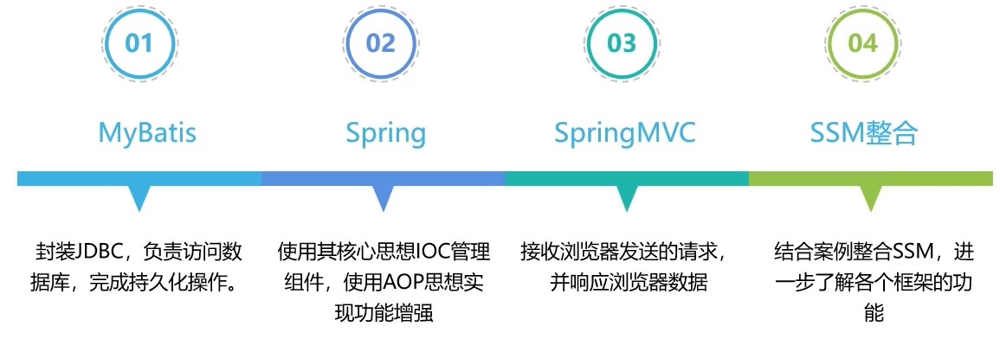
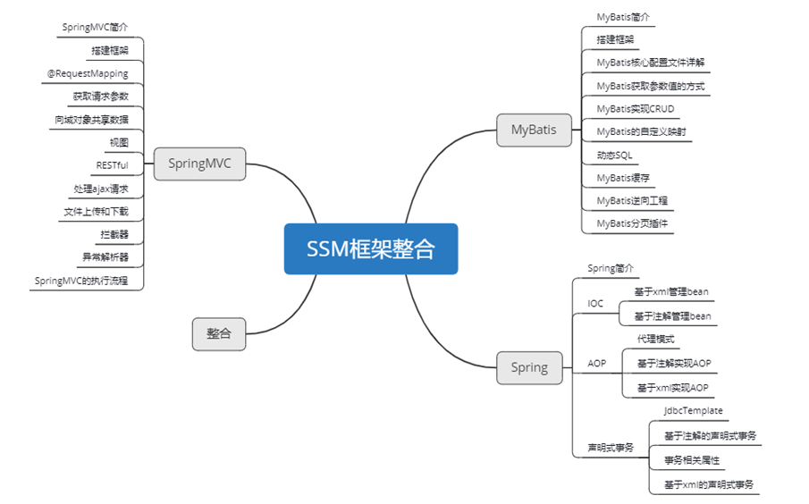

## 课程内容介绍

### SSM简介
SSM（SpringMVC+Spring+MyBatis）是目前市场上最流行的开发web项目的框架，它由SpringMVC、Spring、MyBatis整合而成。SpringMVC框架负责接收浏览器发送的请求，并响应浏览器数据；Spring框架使用其核心IOC思想管理服务器中各个组件，使用AOP思想面向切面编程，在不改变源码的基础上实现功能增强；MyBatis框架封装JDBC，负责访问数据库，完成持久化操作。

### 基础
mysql、jdbc、html、tomcat、Servlet、Thymeleaf、maven...

### 大纲




## 1、ContextLoaderListener
Spring提供了监听器ContextLoaderListener，实现ServletContextListener接口，可监听ServletContext的状态，在web服务器的启动，读取Spring的配置文件，创建Spring的IOC容器。web应用中必须在web.xml中配置
```xml
<listener>
    <!--
        配置Spring的监听器，在服务器启动时加载Spring的配置文件
        Spring配置文件默认位置和名称：/WEB-INF/applicationContext.xml
        可通过上下文参数自定义Spring配置文件的位置和名称
    -->
    <listener-class>org.springframework.web.context.ContextLoaderListener</listener-class>
</listener>
```

```xml
<!--自定义Spring配置文件的位置和名称，我们习惯将配置文件都放在resources文件夹下-->
<context-param>
    <param-name>contextConfigLocation</param-name>
    <param-value>classpath:spring.xml</param-value>
</context-param>
```


## 2、准备工作

### ①创建Maven Module
### ②导入依赖
```xml
<packaging>war</packaging>

<properties>
    <spring.version>5.3.1</spring.version>
</properties>

<dependencies>
    <dependency>
        <groupId>org.springframework</groupId>
        <artifactId>spring-context</artifactId>
        <version>${spring.version}</version>
    </dependency>
    <dependency>
        <groupId>org.springframework</groupId>
        <artifactId>spring-beans</artifactId>
        <version>${spring.version}</version>
    </dependency>
    <!--springmvc-->
    <dependency>
        <groupId>org.springframework</groupId>
        <artifactId>spring-web</artifactId>
        <version>${spring.version}</version>
    </dependency>
    <dependency>
        <groupId>org.springframework</groupId>
        <artifactId>spring-webmvc</artifactId>
        <version>${spring.version}</version>
    </dependency>
    <!-- 事务管理器 -->
    <dependency>
        <groupId>org.springframework</groupId>
        <artifactId>spring-jdbc</artifactId>
        <version>${spring.version}</version>
    </dependency>
    <!-- 切面 -->
    <dependency>
        <groupId>org.springframework</groupId>
        <artifactId>spring-aspects</artifactId>
        <version>${spring.version}</version>
    </dependency>
    <!-- junit -->
    <dependency>
        <groupId>org.springframework</groupId>
        <artifactId>spring-test</artifactId>
        <version>${spring.version}</version>
    </dependency>
    <!-- Mybatis核心 -->
    <dependency>
        <groupId>org.mybatis</groupId>
        <artifactId>mybatis</artifactId>
        <version>3.5.10</version>
    </dependency>
    <!--mybatis和spring的整合包-->
    <dependency>
        <groupId>org.mybatis</groupId>
        <artifactId>mybatis-spring</artifactId>
        <version>2.0.6</version>
    </dependency>
    <!-- 连接池 -->
    <dependency>
        <groupId>com.alibaba</groupId>
        <artifactId>druid</artifactId>
        <version>1.0.9</version>
    </dependency>
    <!-- junit测试 -->
    <dependency>
        <groupId>junit</groupId>
        <artifactId>junit</artifactId>
        <version>4.12</version>
        <scope>test</scope>
    </dependency>
    <!-- MySQL驱动 -->
    <dependency>
        <groupId>mysql</groupId>
        <artifactId>mysql-connector-java</artifactId>
        <version>8.0.30</version>
    </dependency>
    <!-- log4j日志 -->
    <dependency>
        <groupId>log4j</groupId>
        <artifactId>log4j</artifactId>
        <version>1.2.17</version>
    </dependency>
    <!-- https://mvnrepository.com/artifact/com.github.pagehelper/pagehelper -->
    <dependency>
        <groupId>com.github.pagehelper</groupId>
        <artifactId>pagehelper</artifactId>
        <version>5.2.0</version>
    </dependency>
    <!-- 日志 -->
    <dependency>
        <groupId>ch.qos.logback</groupId>
        <artifactId>logback-classic</artifactId>
        <version>1.2.3</version>
    </dependency>
    <!-- ServletAPI -->
    <dependency>
        <groupId>javax.servlet</groupId>
        <artifactId>javax.servlet-api</artifactId>
        <version>3.1.0</version>
        <scope>provided</scope>
    </dependency>
    <!-- json -->
    <dependency>
        <groupId>com.fasterxml.jackson.core</groupId>
        <artifactId>jackson-databind</artifactId>
        <version>2.12.1</version>
    </dependency>
    <!-- 文件上传 -->
    <dependency>
        <groupId>commons-fileupload</groupId>
        <artifactId>commons-fileupload</artifactId>
        <version>1.3.1</version>
    </dependency>
    <!-- Spring5和Thymeleaf整合包 -->
    <dependency>
        <groupId>org.thymeleaf</groupId>
        <artifactId>thymeleaf-spring5</artifactId>
        <version>3.0.12.RELEASE</version>
    </dependency>
</dependencies>
<build>
    <plugins>
        <plugin>
            <groupId>org.apache.maven.plugins</groupId>
            <artifactId>maven-war-plugin</artifactId>
            <version>3.3.1</version>
        </plugin>
    </plugins>
</build>
```

### ③创建表
```sql
CREATE TABLE `t_emp` (
    `emp_id` int(11) NOT NULL AUTO_INCREMENT,
    `emp_name` varchar(20) DEFAULT NULL,
    `age` int(11) DEFAULT NULL,
    `sex` char(1) DEFAULT NULL,
    `email` varchar(50) DEFAULT NULL,
    PRIMARY KEY (`emp_id`)
) ENGINE=InnoDB DEFAULT CHARSET=utf8
```


## 3、配置web.xml
```xml
<?xml version="1.0" encoding="UTF-8"?>
<web-app xmlns="http://xmlns.jcp.org/xml/ns/javaee"
        xmlns:xsi="http://www.w3.org/2001/XMLSchema-instance"
        xsi:schemaLocation="http://xmlns.jcp.org/xml/ns/javaee http://xmlns.jcp.org/xml/ns/javaee/web-app_4_0.xsd" version="4.0">

    <!--配置Spring的编码过滤器-->
    <filter>
        <filter-name>CharacterEncodingFilter</filter-name>
        <filter-class>org.springframework.web.filter.CharacterEncodingFilter</filter-class>
        <init-param>
            <param-name>encoding</param-name>
            <param-value>UTF-8</param-value>
        </init-param>
        <init-param>
            <param-name>forceEncoding</param-name>
            <param-value>true</param-value>
        </init-param>
    </filter>
    <filter-mapping>
        <filter-name>CharacterEncodingFilter</filter-name>
        <url-pattern>/*</url-pattern>
    </filter-mapping>

    <!--配置处理请求方式PUT和DELETE的过滤器-->
    <filter>
        <filter-name>HiddenHttpMethodFilter</filter-name>
        <filter-class>org.springframework.web.filter.HiddenHttpMethodFilter</filter-class>
    </filter>
    <filter-mapping>
        <filter-name>HiddenHttpMethodFilter</filter-name>
        <url-pattern>/*</url-pattern>
    </filter-mapping>

    <!--配置SpringMVC的前端控制器DispatcherServlet-->
    <servlet>
        <servlet-name>DispatcherServlet</servlet-name>
        <servlet-class>org.springframework.web.servlet.DispatcherServlet</servlet-class>
        <!--设置SpringMVC配置文件自定义的位置和名称-->
        <init-param>
            <param-name>contextConfigLocation</param-name>
            <param-value>classpath:springmvc.xml</param-value>
        </init-param>
        <!--将DispatcherServlet的初始化时间提前到服务器启动时-->
        <load-on-startup>1</load-on-startup>
    </servlet>
    <servlet-mapping>
        <servlet-name>DispatcherServlet</servlet-name>
        <url-pattern>/</url-pattern>
    </servlet-mapping>

    <!--设置Spring配置文件自定义的位置和名称-->
    <context-param>
        <param-name>contextConfigLocation</param-name>
        <param-value>classpath:spring.xml</param-value>
    </context-param>

    <!--配置Spring的监听器，在服务器启动时加载Spring的配置文件-->
    <!-- 踩坑：如果自定义了Spring配置文件的位置，自定义标签须在该标签之前 -->
    <listener>
        <listener-class>org.springframework.web.context.ContextLoaderListener</listener-class>
    </listener>

</web-app>
```


## 4、创建SpringMVC的配置文件并配置
```xml
<?xml version="1.0" encoding="UTF-8"?>
<beans xmlns="http://www.springframework.org/schema/beans"
       xmlns:xsi="http://www.w3.org/2001/XMLSchema-instance"
       xmlns:context="http://www.springframework.org/schema/context"
       xmlns:mvc="http://www.springframework.org/schema/mvc"
       xsi:schemaLocation="http://www.springframework.org/schema/beans http://www.springframework.org/schema/beans/spring-beans.xsd
                           http://www.springframework.org/schema/context https://www.springframework.org/schema/context/spring-context.xsd
                           http://www.springframework.org/schema/mvc https://www.springframework.org/schema/mvc/spring-mvc.xsd">

    <!--扫描控制层组件-->
    <context:component-scan base-package="com.atguigu.ssm.controller"></context:component-scan>

    <!--配置视图解析器-->
    <bean id="viewResolver" class="org.thymeleaf.spring5.view.ThymeleafViewResolver">
        <property name="order" value="1" />
        <property name="characterEncoding" value="UTF-8" />
        <property name="templateEngine">
            <bean class="org.thymeleaf.spring5.SpringTemplateEngine">
                <property name="templateResolver">
                    <bean class="org.thymeleaf.spring5.templateresolver.SpringResourceTemplateResolver">
                        <!-- 视图前缀 -->
                        <property name="prefix" value="/WEB-INF/templates/" />
                        <!-- 视图后缀 -->
                        <property name="suffix" value=".html" />
                        <property name="templateMode" value="HTML5" />
                        <property name="characterEncoding" value="UTF-8" />
                    </bean>
                </property>
            </bean>
        </property>
    </bean>

    <!--配置默认的servlet处理静态资源-->
    <mvc:default-servlet-handler />

    <!--开启mvc的注解驱动-->
    <mvc:annotation-driven />

    <!--配置视图控制器-->
    <mvc:view-controller path="/" view-name="index"></mvc:view-controller>

    <!--配置文件上传解析器-->
    <bean id="multipartResolver" class="org.springframework.web.multipart.commons.CommonsMultipartResolver"></bean>

</beans>
```


## 5、搭建MyBatis环境

### ①创建属性文件jdbc.properties
```properties
jdbc.driver=com.mysql.cj.jdbc.Driver
jdbc.url=jdbc:mysql://localhost:3306/ssm?serverTimezone=UTC
jdbc.user=root
jdbc.password=123456
```

### ②创建MyBatis的核心配置文件mybatis-config.xml
```xml
<?xml version="1.0" encoding="UTF-8"?>
<!DOCTYPE configuration
        PUBLIC "-//mybatis.org//DTD Config 3.0//EN"
        "http://mybatis.org/dtd/mybatis-3-config.dtd">

<configuration>

    <settings>
        <!--将下划线映射为驼峰-->
        <setting name="mapUnderscoreToCamelCase" value="true" />
    </settings>

    <plugins>
        <!--配置分页插件-->
        <plugin interceptor="com.github.pagehelper.PageInterceptor"></plugin>
    </plugins>

</configuration>
```

### ③创建Mapper接口和映射文件
```java
public interface EmployeeMapper {

    /**
     * 查询所有的员工信息
     * 
     * @return
     */
    List<Employee> getAllEmployee();
}
```

```xml
<?xml version="1.0" encoding="UTF-8"?>
<!DOCTYPE mapper
        PUBLIC "-//mybatis.org//DTD Mapper 3.0//EN"
        "http://mybatis.org/dtd/mybatis-3-mapper.dtd">

<mapper namespace="com.atguigu.ssm.mapper.EmployeeMapper">

    <!--List<Employee> getAllEmployee();-->
    <select id="getAllEmployee" resultType="Employee">
        select * from t_emp
    </select>

</mapper>
```

### ④创建日志文件log4j.xml
```xml
<?xml version="1.0" encoding="UTF-8"?>
<!DOCTYPE log4j:configuration SYSTEM "log4j.dtd">

<log4j:configuration xmlns:log4j="http://jakarta.apache.org/log4j/">

    <appender name="STDOUT" class="org.apache.log4j.ConsoleAppender">
        <param name="Encoding" value="UTF-8" />
        <layout class="org.apache.log4j.PatternLayout">
            <param name="ConversionPattern" value="%-5p %d{MM-dd HH:mm:ss,SSS} %m  (%F:%L) \n" />
        </layout>
    </appender>
    <logger name="java.sql">
        <level value="debug" />
    </logger>
    <logger name="org.apache.ibatis">
        <level value="info" />
    </logger>
    <root>
        <level value="debug" />
        <appender-ref ref="STDOUT" />
    </root>
</log4j:configuration>
```


## 6、创建Spring的配置文件并配置
```xml
<?xml version="1.0" encoding="UTF-8"?>
<beans xmlns="http://www.springframework.org/schema/beans"
       xmlns:xsi="http://www.w3.org/2001/XMLSchema-instance"
       xmlns:context="http://www.springframework.org/schema/context"
       xmlns:tx="http://www.springframework.org/schema/tx"
       xsi:schemaLocation="http://www.springframework.org/schema/beans http://www.springframework.org/schema/beans/spring-beans.xsd
                           http://www.springframework.org/schema/context https://www.springframework.org/schema/context/spring-context.xsd
                           http://www.springframework.org/schema/tx http://www.springframework.org/schema/tx/spring-tx.xsd">

    <!--扫描组件（除控制层）-->
    <context:component-scan base-package="com.atguigu.ssm">
        <context:exclude-filter type="annotation" expression="org.springframework.stereotype.Controller" />
    </context:component-scan>

    <!--引入jdbc.properties-->
    <context:property-placeholder location="classpath:jdbc.properties"></context:property-placeholder>

    <!--配置数据源-->
    <bean id="dataSource" class="com.alibaba.druid.pool.DruidDataSource">
        <property name="driverClassName" value="${jdbc.driver}"></property>
        <property name="url" value="${jdbc.url}"></property>
        <property name="username" value="${jdbc.username}"></property>
        <property name="password" value="${jdbc.password}"></property>
    </bean>

    <!--配置事务管理器-->
    <bean id="transactionManager" class="org.springframework.jdbc.datasource.DataSourceTransactionManager">
        <property name="dataSource" ref="dataSource"></property>
    </bean>

    <!--
        开启事务的注解驱动
        将使用注解@Transactional标识的方法或类中所有的方法进行事务管理
    -->
    <tx:annotation-driven transaction-manager="transactionManager" />

    <!--配置用于创建SqlSessionFactory的工厂Bean：SqlSessionFactoryBean，可以直接在Spring的IOC中获取SqlSessionFactory-->
    <bean class="org.mybatis.spring.SqlSessionFactoryBean">
        <!--设置MyBatis的核心配置文件的路径（可不设置）-->
        <property name="configLocation" value="classpath:mybatis-config.xml"></property>
        <!--设置数据源-->
        <property name="dataSource" ref="dataSource"></property>
        <!--设置类型别名所对应的包-->
        <property name="typeAliasesPackage" value="com.atguigu.ssm.pojo"></property>
        <!--
            设置映射文件的路径
            若映射文件所在路径和mapper接口所在路径一致且配置了MapperScannerConfigurer，则不需要设置
        -->
        <!--<property name="mapperLocations" value="classpath:mappers/*.xml"></property>-->
    </bean>

    <!--
        配置mapper接口的扫描配置
        由mybatis-spring提供，可以将指定包下所有的mapper接口创建动态代理
        并将这些动态代理作为IOC容器的bean管理
    -->
    <bean class="org.mybatis.spring.mapper.MapperScannerConfigurer">
        <property name="basePackage" value="com.atguigu.ssm.mapper"></property>
    </bean>

</beans>
```


## 7、测试功能

### ①创建组件
实体类
```java
public class Employee {

    private Integer empId;

    private String empName;

    private Integer age;

    private String gender;

    private String email;

    public Employee() {
    }

    public Employee(Integer empId, String empName, Integer age, String gender, String email) {
        this.empId = empId;
        this.empName = empName;
        this.age = age;
        this.gender = gender;
        this.email = email;
    }

    public Integer getEmpId() {
        return empId;
    }

    public void setEmpId(Integer empId) {
        this.empId = empId;
    }

    public String getEmpName() {
        return empName;
    }

    public void setEmpName(String empName) {
        this.empName = empName;
    }

    public Integer getAge() {
        return age;
    }

    public void setAge(Integer age) {
        this.age = age;
    }

    public String getGender() {
        return gender;
    }

    public void setGender(String gender) {
        this.gender = gender;
    }

    public String getEmail() {
        return email;
    }

    public void setEmail(String email) {
        this.email = email;
    }

    @Override
    public String toString() {
        return "Employee{" +
                "empId=" + empId +
                ", empName='" + empName + '\'' +
                ", age=" + age +
                ", gender='" + gender + '\'' +
                ", email='" + email + '\'' +
                '}';
    }
}
```

控制层
```java
/**
 * 查询所有的员工信息-->/employee-->get
 * 查询员工的分页信息-->/employee/page/1-->get
 * 根据id查询员工信息-->/employee/1-->get
 * 跳转到添加页面-->/to/add-->get
 * 添加员工信息-->/employee-->post
 * 修改员工信息-->/employee-->put
 * 删除员工信息-->/employee/1-->delete
 */
@Controller
public class EmployeeController {

    @Autowired
    private EmployeeService employeeService;

    @RequestMapping(value = "/employee/page/{pageNum}", method = RequestMethod.GET)
    public String getEmployeePage(@PathVariable("pageNum") Integer pageNum, Model model) {
        // 获取员工的分页信息
        PageInfo<Employee> page = employeeService.getEmployeePage(pageNum);
        // 将分页数据共享到请求域中
        model.addAttribute("page", page);
        // 跳转到employee_list.html
        return "employee_list";
    }

}
```

服务层
```java
public interface EmployeeService {

    /**
     * 获取员工的分页信息
     * 
     * @param pageNum
     * @return
     */
    PageInfo<Employee> getEmployeePage(Integer pageNum);
}

@Service
@Transactional
public class EmployeeServiceImpl implements EmployeeService {

    @Autowired
    private EmployeeMapper employeeMapper;

    @Override
    public PageInfo<Employee> getEmployeePage(Integer pageNum) {
        // 开启分页功能
        PageHelper.startPage(pageNum, 4);
        // 查询所有的员工信息
        List<Employee> list = employeeMapper.getAllEmployee();
        // 获取分页相关数据
        PageInfo<Employee> page = new PageInfo<>(list, 5);
        return page;
    }
}
```

### ②创建页面
```html
<!DOCTYPE html>
<html lang="en" xmlns:th="http://www.thymeleaf.org">

<head>
    <meta charset="UTF-8">
    <title>员工列表</title>
    <link rel="stylesheet" th:href="@{/static/css/index_work.css}">
</head>

<body>
    <table>
        <tr>
            <th colspan="6">员工列表</th>
        </tr>
        <tr>
            <th>流水号</th>
            <th>员工姓名</th>
            <th>年龄</th>
            <th>性别</th>
            <th>邮箱</th>
            <th>操作</th>
        </tr>
        <tr th:each="employee,status : ${page.list}">
            <td th:text="${status.count}"></td>
            <td th:text="${employee.empName}"></td>
            <td th:text="${employee.age}"></td>
            <td th:text="${employee.gender}"></td>
            <td th:text="${employee.email}"></td>
            <td>
                <a href="">删除</a>
                <a href="">修改</a>
            </td>
        </tr>
    </table>
    <div style="text-align: center;">
        <a th:if="${page.hasPreviousPage}" th:href="@{/employee/page/1}">首页</a>
        <a th:if="${page.hasPreviousPage}" th:href="@{'/employee/page/'+${page.prePage}}">上一页</a>
        <span th:each="num : ${page.navigatepageNums}">
            <a th:if="${page.pageNum == num}" style="color: red;" th:href="@{'/employee/page/'+${num}}"
                th:text="'['+${num}+']'"></a>
            <a th:if="${page.pageNum != num}" th:href="@{'/employee/page/'+${num}}" th:text="${num}"></a>
        </span>
        <a th:if="${page.hasNextPage}" th:href="@{'/employee/page/'+${page.nextPage}}">下一页</a>
        <a th:if="${page.hasNextPage}" th:href="@{'/employee/page/'+${page.pages}}">末页</a>
    </div>
</body>

</html>
```

### ③访问测试分页功能
> http://localhost:8080/ssm/employee/page/1
